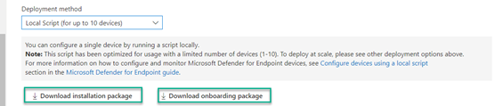
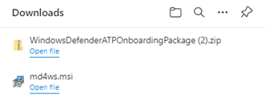
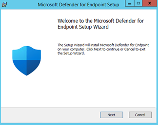
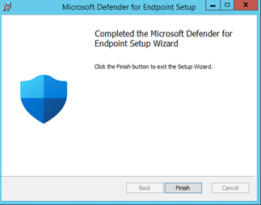
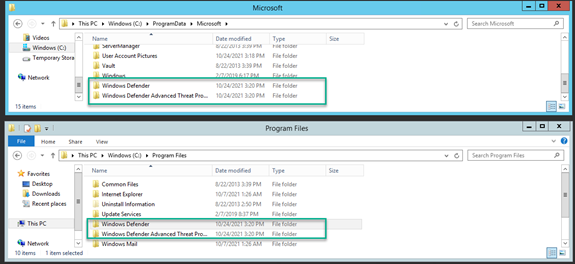
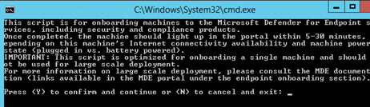
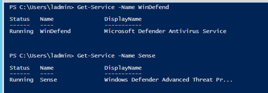
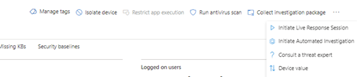

Hello everyone,

Just in case you missed this, earlier in October, Microsoft [announced](https://techcommunity.microsoft.com/t5/microsoft-defender-for-endpoint/defending-windows-server-2012-r2-and-2016/ba-p/2783292) the public preview for the Microsoft Defender for endpoint, unified solution for Windows Server 2012 R2 and 2016 that enables additional protection features and brings a high level of parity with Microsoft Defender for endpoint on Windows Server 2019. The unified solution also provides a much simpler onboarding experience.

Before taking a closer look at the new unified solution, let's briefly look at how things worked until now. Onboarding Windows 10 and Windows Server 2019 is simple, all you need to do is run an onboarding script that basically enables the Microsoft Defender for Endpoint component that is already built-in the operating system, i.e. there's no need to deploy and install any additional software. Things are different with Windows Server 2012-R2 and Windows Server 2016 though.

- Windows Server 2012-R2 that was released on November 25th in 2013 does not have Windows Defender built in so to onboard these servers into Microsoft Defender for endpoint, we first need to enable Windows Defender that is done by installing the SCEP (System Center Endpoint Protection) Agent and then we need the Log Analytics Agent that is used to download and run the Microsoft Defender for Endpoint components. When you use Group Policy to configure Windows Defender Antivirus you also need to use separate administrative templates, meaning that you have to maintain settings in two different locations.
- On Windows Server 2016 that was released on October 15th in 2016, Windows Defender is already shipped as part of the operating system, so there's no need for deploying the SCEP agent, but we still need the Log Analytics agent for the Microsoft Defender for endpoint components.

As you can see, the onboarding experience for Server 2012-R2 and Server 2016 was a bit complex but with the new unified solution this complexity is removed. Let's try this out.

When you select the onboarding options for Servers within the Microsoft Defender for Endpoint portal, you will now see two options.

Today we will look at the local script option (other options will be discussed in a future post).

The md4ws.msi installation package includes all the components you need to run Microsoft Defender for Endpoint on Server 2012-R2 and Server 2016. Now let's install this on a Windows Server 2012-R2 device.

Once completed, Windows Defender and Defender for endpoint is installed.

Now that we have 'component' parity with Windows 10 and Windows Server 2019, all we need to do for activating Microsoft Defender for endpoint is to run the onboarding script.

While when using the Log Analytics agent to deliver Defender for Endpoint the 'Process' mssense.exe was running, we now have it running as a Service.

The new unified solution also enables the following protection capabilities for Server 2012-R2 and Server 2016.

- Microsoft Defender Antivirus with Next-generation protection for Windows Server 2012 R2
- Attack Surface Reduction (ASR) rules
- Network Protection
- Controlled Folder Access
- Potentially Unwanted Application (PUA) blocking
- Improved detection capabilities
- Expanded response capabilities on devices and files
- EDR in Block Mode
- Live Response
- Automated Investigation and Response (AIR)
- Tamper Protection

Source: [https://docs.microsoft.com/en-us/microsoft-365/security/defender-endpoint/configure-server-endpoints?view=o365-worldwide#new-functionality-in-the-modern-unified-solution-for-windows-server-2012-r2-and-2016-preview](https://docs.microsoft.com/en-us/microsoft-365/security/defender-endpoint/configure-server-endpoints?view=o365-worldwide#new-functionality-in-the-modern-unified-solution-for-windows-server-2012-r2-and-2016-preview)

When looking at the device actions, you will notice that the unified solution now enables additional capabilities.

That's it for today, in the next blog post we will look at migrating servers currently running the SCEP/Log Analytics agent to use the new unified solution.

