Hello everyone,

In my previous post ([Part1](https://www.verboon.info/2021/10/defender-for-endpoint-unified-solution-for-windows-server-2012-r2-and-2016-part1/)) I provided an overview of the new Microsoft Defender for endpoint unified solution for Windows Server 2012-R2 and 2016 and how to deploy the solution manually to a new provisioned server. In this blog post I would like to walk you through the process of migrating a Windows 2016 server to the new unified solution using Microsoft Endpoint Configuration Manager.

For this we will be using the [upgrade script](https://github.com/microsoft/mdefordownlevelserver) that Microsoft provides. But let's go through this step by step.

## Preparing the package content

Within Microsoft Endpoint Configuration Manager we need a package or application that deploys the new unified solution to servers. In my lab I created a package. The package content is as following:


**Install.ps1** – The script provided by Microsoft hosted here on GitHub [https://github.com/microsoft/mdefordownlevelserver/blob/main/Install.ps1](https://github.com/microsoft/mdefordownlevelserver/blob/main/Install.ps1) The script can be used for various scenarios, but in our case it will do the following:

1. It removes the OMS workspace when the workspace ID is provided with the parameter RemoveMMA. **NOTE: this step is for cleanup purposes only.**
2. The next step uninstalls SCEP - if it is present. (On a Windows Server 2016 there will be no SCEP agent so this step is skipped)
3. Then, it checks for prerequisites and downloads and installs two hotfixes on Windows Server 2012 R2 if the prerequisites have not been met, and updates to the latest platform version on Windows Server 2016 if required (currently installed platform version must already be 4.18.2001.10 or higher). Note that on machines that have received recent monthly update rollup packages, the prerequisites will have been met and this step is NOT needed. The installer script also checks for, downloads and installs the latest Defender Antivirus platform update on Windows Server 2016 to ensure the prerequisite is met.
4. Next, it installs the Microsoft Defender for Downlevel Servers MSI (md4ws.msi downloaded from the onboarding page for Windows Server 2012 R2 and 2016). If the file is in the same directory as the script, no input is required. If the product was already installed, it will perform a reinstallation with the provided MSI.
5. Finally, it runs the onboarding script, if provided using the parameter OnboardingScript.

You can find more details about the installer script here: [https://github.com/microsoft/mdefordownlevelserver](https://github.com/microsoft/mdefordownlevelserver)

**Md4ws.msi** and **WindowsDefenderATPOnboardingScript.cmd** – Both files can be downloaded from the Microsoft 365 Security portal.

Within the Microsoft 365 Security portal, select Settings / Endpoints / Device Management / Onboarding, then select Windows Server 2012 R2 and 2016 Preview and for the deployment method select Microsoft Endpoint Configuration Manager.

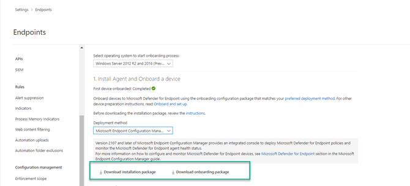

Next, leave the Operating system, but now select the deployment option that mentions 'using Microsoft Monitoring Agent).

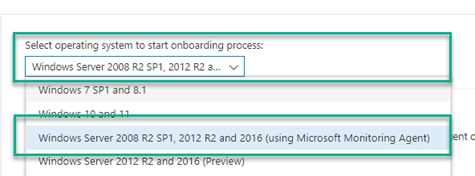

Then note down the workspace ID, we're going to use this later.

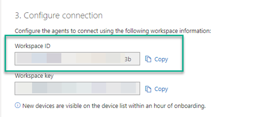

## Creating the package in Microsoft Endpoint Configuration Manager

Here's the configuration of my MDE upgrade package in Microsoft Endpoint Configuration Manager.

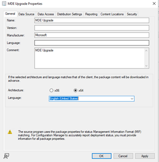

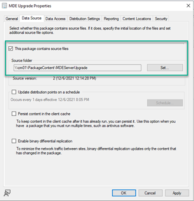

Next let's look at the Program properties of the package.

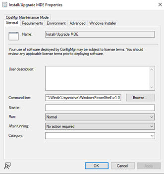

The command line is as following, please replace `<ADD YOUR WORKSPACE ID HERE>` with the workspace ID that you noted down previously.

```
"%Windir%\sysnative\WindowsPowerShell\v1.0\powershell.exe" -ExecutionPolicy Bypass -Command .\Install.ps1 -RemoveMMA <ADD YOUR WORKSPACE ID HERE> -log -etl -OnboardingScript ".\WindowsDefenderATPOnboardingScript.CMD"
```

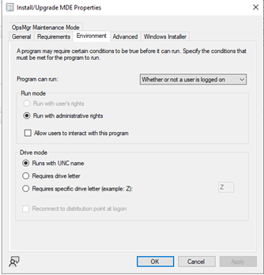

Great now that you have prepared the package, let's deploy it. **But do not forget to distribute the content** of the package to your distribution points (back in the days when I used to support ConfigMgr that would have been my first question I asked people when calling about a package not installing).

## Deploying the Upgrade package

Now where to deploy? I guess for your initial deployment you know exactly what system you want to upgrade. But before moving on with the deployment let me know you a handy tip how you can identify systems that have the MMA Agent deployed with the Endpoint Manager workspace ID configured.

Run CMPivot on a device collection that includes your existing MDE onboarded servers and then add the Workspace ID to the query as shown below.

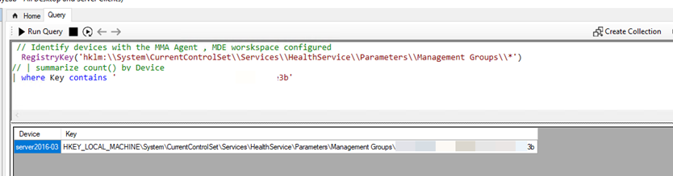

In this example, Server2016-03 was identified to have the MMA Agent pointing to the MDE workspace. This is important to know, because the MMA Agent can point to multiple workspaces, as for example you might also be using the agent to collect Windows security event logs or performance data. Knowing your current MMA configuration will help you to identify the systems where you can completely remove the MMA agent later or leave it running.

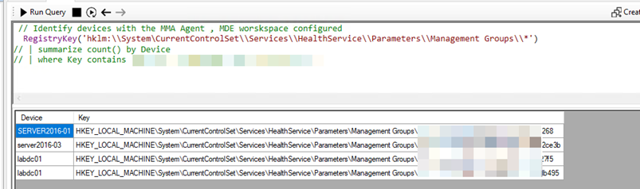

Okay, now let's deploy the upgrade package. For this I created a collection within Microsoft Endpoint Configuration Manager and added the server to the collection.

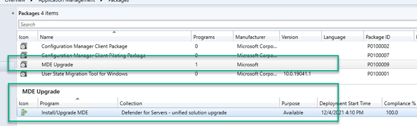

Note that I have set the Deployment to 'Available' for demo purposes, to run this automatically in production, set this to 'Required'.

Here's our system before the upgrade.

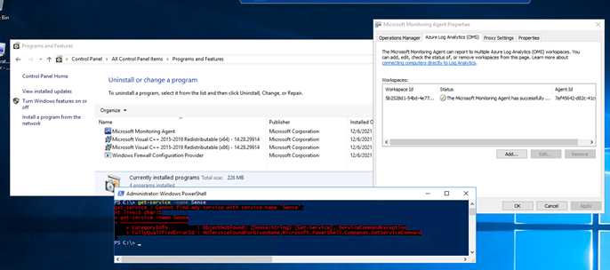

Open the Microsoft Endpoint Configuration Manager Software Center and install the package.

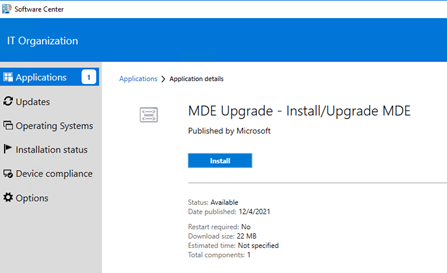

Remember we added the -log and -etl command line options to the install.ps1 script? You will find the log files within the ccmcache folder where the package was downloaded.

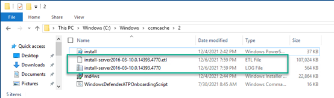

Here's our system after the upgrade

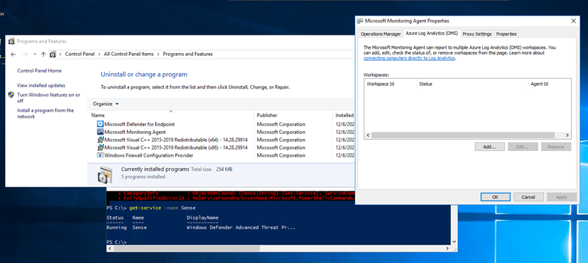

- The Microsoft Defender for Endpoint component is installed
- The workspace configuration is removed from the MMA Agent
- The Microsoft Defender for Endpoint 'Sense' service is running
- The system was successfully re-onboarded.

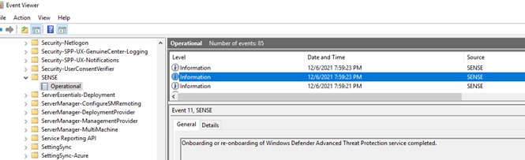

That's it for today, thanks for reading my blog

Alex

## References

- [Onboard Windows servers to the Microsoft Defender for Endpoint service | Microsoft Docs](https://docs.microsoft.com/en-us/microsoft-365/security/defender-endpoint/configure-server-endpoints?view=o365-worldwide)
- [Server migration scenarios for the new version of Microsoft Defender for Endpoint | Microsoft Docs](https://docs.microsoft.com/en-us/microsoft-365/security/defender-endpoint/server-migration?view=o365-worldwide)


