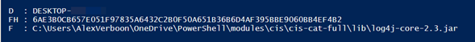
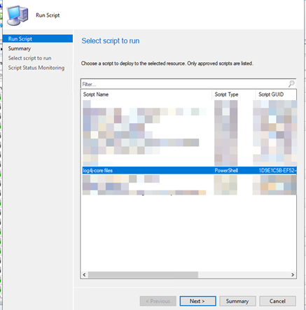
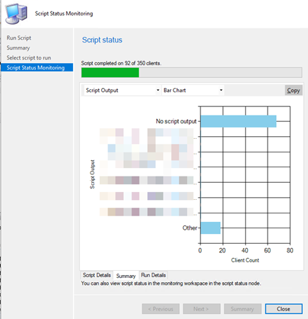
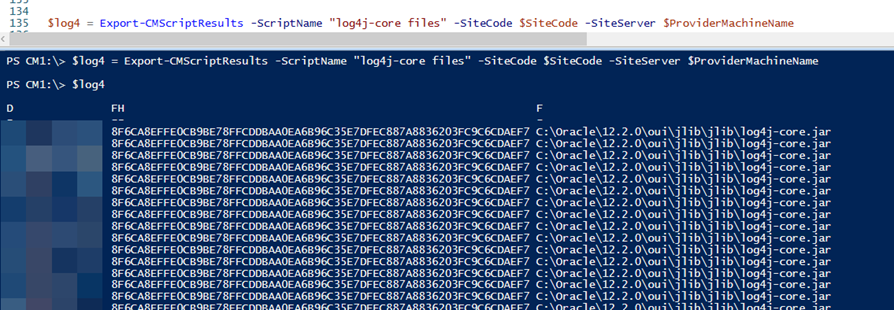
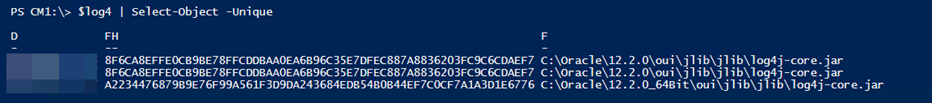
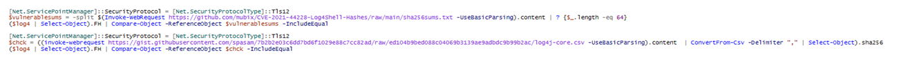
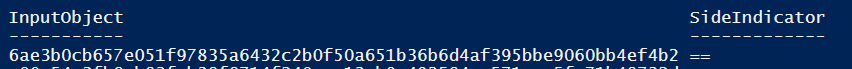

Hello there,

These days everyone is trying to identify devices that are vulnerable to the Log4Shell Vulnerability (CVE-2021-44228). If your only systems management tool is Microsoft Endpoint Configuration Manager this blog is for you.

You can of course create device collections based on installed programs, however log4j-core.jar files can be found in several locations in and outside the Program files folder. So in order to identify these files, we have to search for them on the entire disk. Here's the script I prepared for that.

*Note that I have intentionally limited the drive letters to a-e, adjust this if you know of systems with more drive letters.*

You can find the script here: [https://gist.github.com/alexverboon/0a7a32b8f1267f4a9ac34b5e1c5b1ba5](https://gist.github.com/alexverboon/0a7a32b8f1267f4a9ac34b5e1c5b1ba5)

The script produces the following output.

Next, import the script into the Microsoft Endpoint Configuration Manager Script library. Then select a device collection and run the script.

Next, we are going to extract the Run Script results with PowerShell. I wrote about this method earlier in this blog post [Extract ConfigMgr Script Status Results with PowerShell](https://www.verboon.info/2019/09/extract-configmgr-script-status-results-with-powershell/)

Open PowerShell from the ConfigMgr console and then load the **Export-CMScriptResults** function that you copied from the blog post mentioned above or from here: [Export-CMScriptResults (github.com)](https://gist.github.com/alexverboon/e67fc2ecde3c2fbe44f6413cf20e00d9)

We now have all the results in our PowerShell variable $log4 so we can further review the data

And as a little bonus, let's compare the identified files with some log4j-core.jar file hash references available on GitHub

The above code snippets can be found here: [https://gist.github.com/alexverboon/13a5defd8ebfac491ab9313491d995a4](https://gist.github.com/alexverboon/13a5defd8ebfac491ab9313491d995a4)

If you have a match, it will show the output as following:

I hope you enjoyed this blog post, have a great day and good luck with identifying vulnerable devices.

## Credits / References

- [SCCM scan for Log4J : SCCM (reddit.com)](https://www.reddit.com/r/SCCM/comments/rdl6mo/sccm_scan_for_log4j/?utm_source=share&utm_medium=ios_app&utm_name=iossmf)
- [Log4Shell: RCE 0-day exploit found in log4j 2, a popular Java logging package | LunaSec](https://www.lunasec.io/docs/blog/log4j-zero-day/)
- [mubix/CVE-2021-44228-Log4Shell-Hashes: Hashes for vulnerable LOG4J versions (github.com)](https://github.com/mubix/CVE-2021-44228-Log4Shell-Hashes)
- [log4j2 core jar versions and checksums (github.com)](https://gist.github.com/spasam/7b2b2e03c6dd7bd6f1029e88c7cc82ad)

