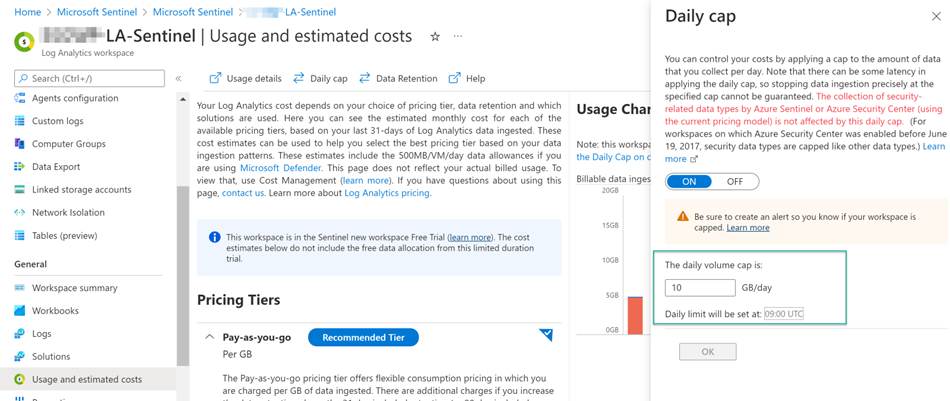
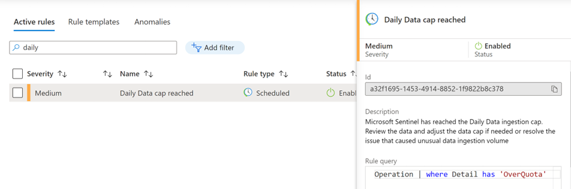
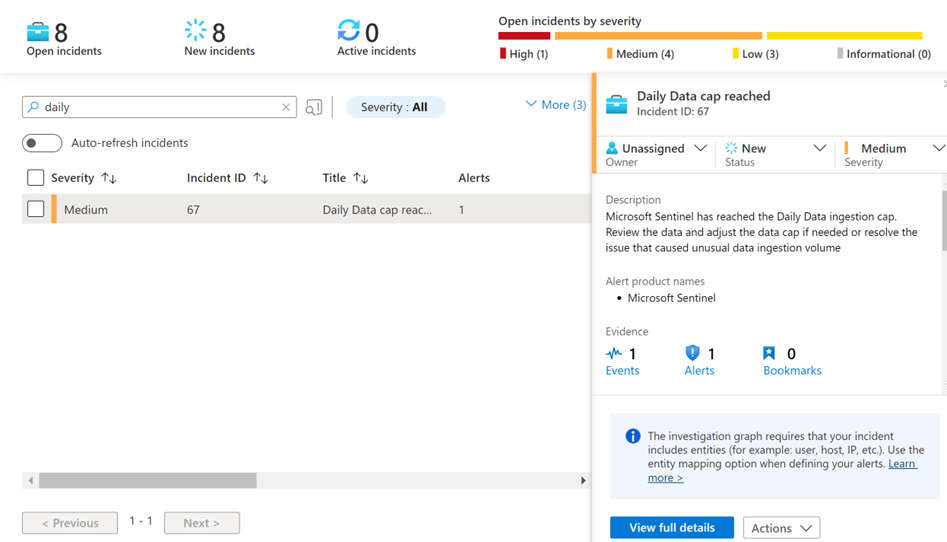
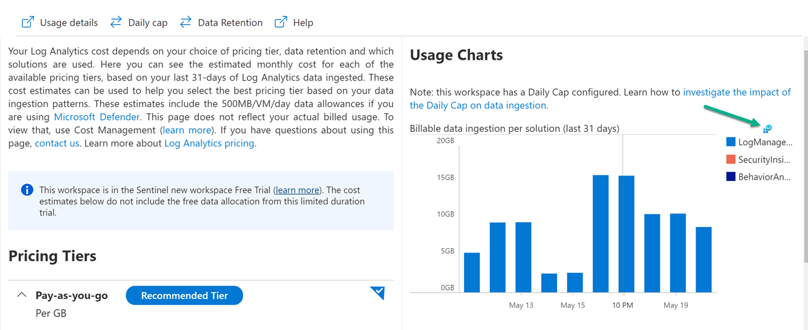
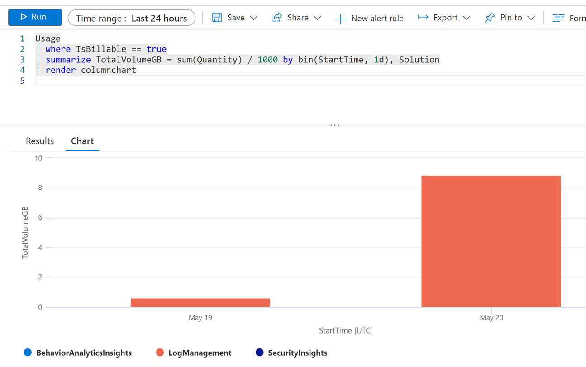
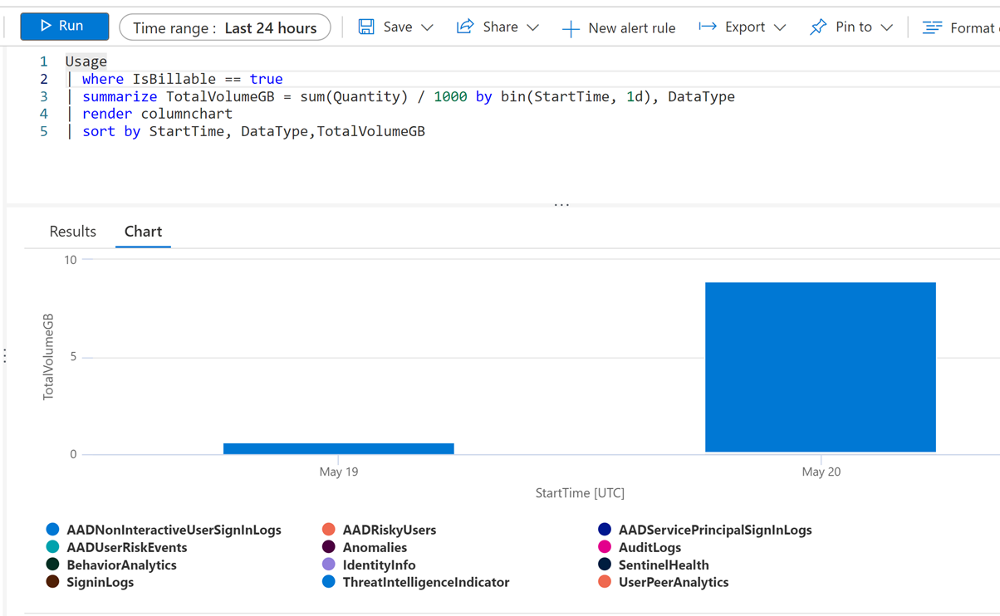
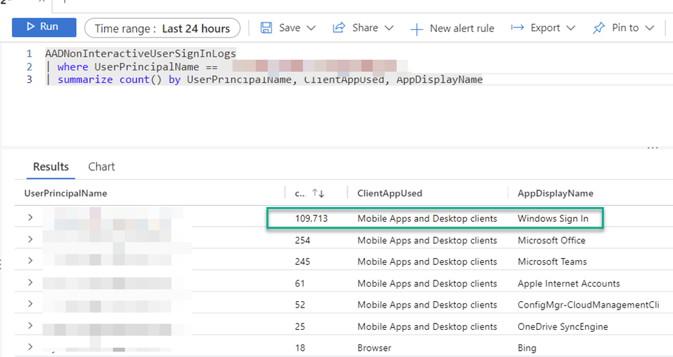
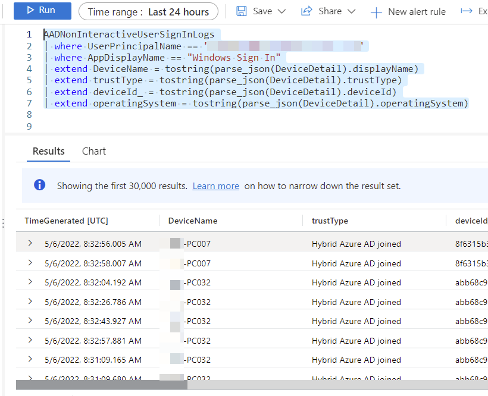
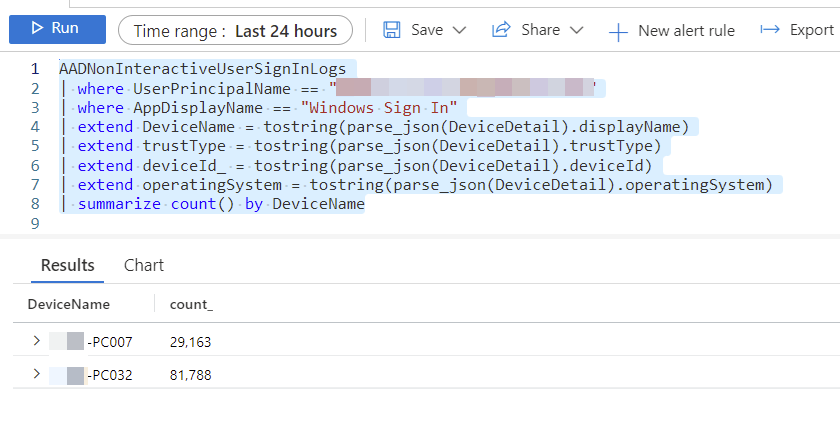

To avoid unplanned costs for Microsoft Sentinel, it is recommended to set a daily cap and create an analytics rule that triggers an alert when the daily cap is reached. Microsoft has published general guidance for monitoring costs [here](https://learn.microsoft.com/azure/sentinel/billing-monitor-costs).

In the past months I have deployed a number of Microsoft Sentinel instances and in many cases the root cause for reaching the daily cap was related to data ingested into the AADNonInteractiveUserSignInLogs table. When analyzing the data we often found an individual user that created an unusually high amount of events. This can happen for various reasons such as:

- The user is still logged on to a device, but has changed their password on another device
- The user has left the company, but is still logged on to some virtual desktops
- The user account is disabled, but the user is still logged on somewhere
- The user has left the company, the account is deactivated, but their mobile phone is still trying to pull emails

Okay, let's start at the beginning.

## Data Cap

To avoid a bill shock, we set a daily cap.



## Analytics Rule

If we want to get alerted, we can set up an analytics rule within Microsoft Sentinel as shown in the example below.



## The Alert

With the analytics rule in place, we get an alert as shown below when the daily data cap is reached.



## Analyzing the Data Usage

Now that we have an alert, we have to investigate what caused the high data volume. Log on to the Azure portal and navigate to the Usage and estimated costs blade within the Microsoft Sentinel Log Analytics workspace. Here we can already identify which solution caused the data ingestion increase. Select Open chart in analytics.



Log Analytics is opened with a predefined query that shows usage. Here we see that LogManagement had an increase in data ingestion. Remove the start date and set the time range to 24 hours.

```kusto
Usage
| where IsBillable == true
| summarize TotalVolumeGB = sum(Quantity) / 1000 by bin(StartTime, 1d), Solution
| render columnchart
```



Change the query to display DataType instead of Solution, then re-run the query.

```kusto
Usage
| where IsBillable == true
| summarize TotalVolumeGB = sum(Quantity) / 1000 by bin(StartTime, 1d), DataType
| render columnchart
```



Next, remove the `| render` instruction from the query to see the details.

```kusto
Usage
| where IsBillable == true
| summarize TotalVolumeGB = sum(Quantity) / 1000 by bin(StartTime, 1d), DataType
```

Now let's find the user(s) that cause the high event volume.

```kusto
AADNonInteractiveUserSignInLogs
| summarize count() by UserPrincipalName
```


Next, we drill down into events for the user that triggers the most events.

```kusto
AADNonInteractiveUserSignInLogs
| where UserPrincipalName == "john.doe@foocorp.com"
| summarize count() by UserPrincipalName, ClientAppUsed, AppDisplayName
```


Here we see that we have a lot of Windows Sign In events. Next, let's drill into the details to identify the device.

```kusto
AADNonInteractiveUserSignInLogs
| where UserPrincipalName == "john.doe@foocorp.com"
| where AppDisplayName == "Windows Sign In"
| extend DeviceName = tostring(parse_json(DeviceDetail).displayName)
| extend trustType = tostring(parse_json(DeviceDetail).trustType)
| extend deviceId_ = tostring(parse_json(DeviceDetail).deviceId)
| extend operatingSystem = tostring(parse_json(DeviceDetail).operatingSystem)
```



Next, let's see how many devices are involved and add the following KQL line.

```kusto
| summarize count() by DeviceName
```



That's it for today, I hope you found this useful. I'm currently working on early detection when logs start to unusually grow, so that IT operations or security teams can take immediate action and prevent the daily cap from being reached.

Bye,

Alex

