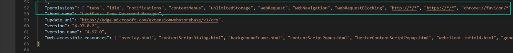
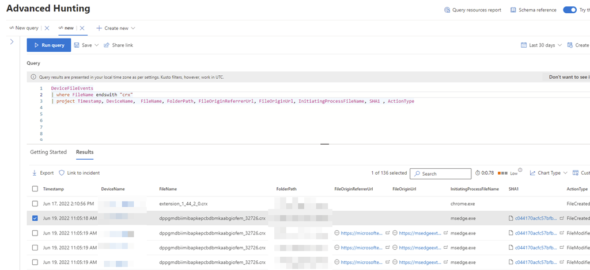
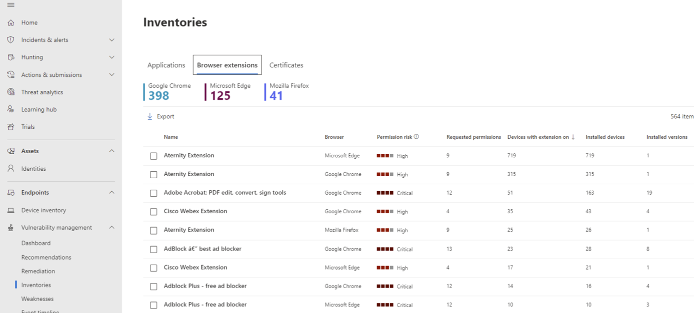
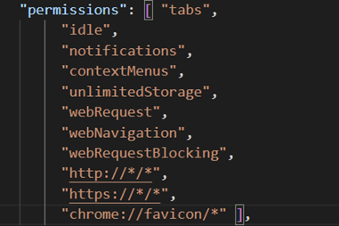
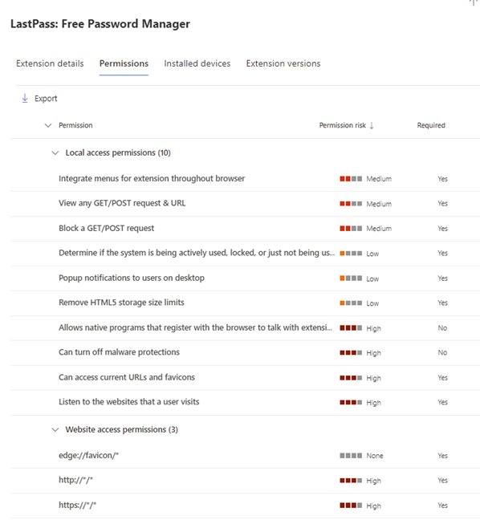
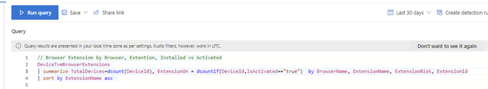
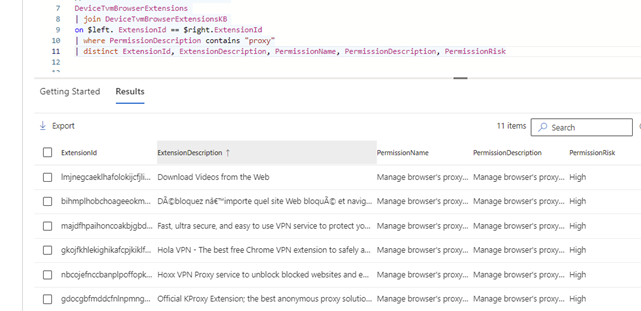
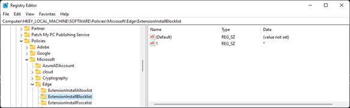

In this blog post we take a look at browser extensions and how Microsoft Defender for Endpoint, Microsoft Defender Threat and Vulnerability Management and system configuration policies can help us to gain control over the use of browser extensions.

- What is a Browser Extension?
- Where are Extensions installed
- Browser Extension Permissions
- Using advanced hunting to identify browser extension downloads
- Browser Extension inventory in Microsoft Defender Threat and vulnerability Management
- Controlling the use of Browser Extensions

## What is a browser extension?

A browser extension is a small software module for customizing a web browser. An extension improves a user's browsing experience. It usually provides a niche function that is important to a target audience.

Well known browser extensions are used for:

- Password Managers
- VPN
- Ad blockers
- User productivity

## Where are Extensions Installed?

When you install a browser extension, the browser stores the content in the following locations:

- **Google Chrome** - AppData\Local\Google\Chrome\User Data\Default\Extensions\
- **Microsoft Edge** - AppData\Local\Microsoft\Edge\User Data\Default\Extensions\
- **Mozillla FireFox** - AppData\Roaming\Mozilla\Firefox\Profiles\*release*\Extensions\

Below is an example of the content of the NordVPN extension

## Browser Extension Permissions

The permissions a browser extension uses are defined within the manifest.json file. Below are the permissions defined for the LastPass browser extension.

Detailed information about the chrome API permissions can be found here: [Declare API permissions in extension manifests](https://docs.microsoft.com/en-us/microsoft-edge/extensions-chromium/enterprise/declare-permissions)

If you are responsible for the security of your company you should pay attention to the permissions a browser extension is using, I recommend reading the whitepaper [Understand the risks of permissions for Chrome extensions](https://support.google.com/chrome/a/answer/9897812?hl=en).

## Using advanced hunting to identify browser extension downloads

Extensions for Edge Chromium and Google chrome are packed in a file that ends with CRX, hence we can use advanced hunting in Microsoft Defender for endpoint to identify devices that download extensions.

## Browser Extension inventory in Microsoft Defender

Last month Microsoft [announced](https://techcommunity.microsoft.com/t5/microsoft-defender-vulnerability/announcing-microsoft-defender-vulnerability-management-in-public/ba-p/3361003) the public preview of Microsoft Defender for Threat and vulnerability management. Defender Vulnerability Management's **browser extensions inventory** provides [detailed information](https://docs.microsoft.com/en-us/microsoft-365/security/defender-vulnerability-management/tvm-browser-extensions?view=o365-worldwide) on the permissions requested by each extension and identifies those with the highest associated risk levels.

Let's take a look at the LastPass extension permissions, within the manifest.json file the permissions are defined as following:

Microsoft Defender Threat and Vulnerability management nicely translates these permissions as shown below.

We can use advanced hunting to query the browser extension data.

Let's take a look at all the extensions that have the **proxy** permission

## Controlling the use of Browser Extensions

Now that we have an overview of the extensions in use, you might to start taking control over what extensions you allow to be used and what extensions you want to block. We can use Active Directory Group Policy or Microsoft Endpoint Manager Intune configuration profiles to control the use of Browser extensions.

- **Control which extensions cannot be installed** - use this policy to explicitly block the use of certain extensions or just configure with * if you want to block everything and only allow explicitly defined extensions
- **Allow specific extensions to be installed** - Use this policy to allow users to install the extension when they need it
- **Control which extensions are installed silently** - Use this policy to force the installation of an extensions (and prevent removal) for extensions that are used across the enterprise.
- **ExtensionSettings** - You can control what extensions your users can install based on permissions using the ExtensionSettings policy

Here, by default we do not allow the user to install any extension, except for those that are explicitly defined.

For more details see: [Use group policies to manage Microsoft Edge extensions](https://docs.microsoft.com/en-us/deployedge/microsoft-edge-manage-extensions-policies)

## Conclusion

Browser extensions can be very useful, if you don't allow users to install software themselves, i.e. don't grant them local administrative rights, you should also consider to actively manage the use of browser extensions.

I hope you find this post useful, as always I welcome your feedback.

## Additional References

- MITRE ATT&CK – Browser Extensions
  [https://attack.mitre.org/techniques/T1176/](https://attack.mitre.org/techniques/T1176/)
- Understand the risks of permissions for Chrome extensions
  [https://support.google.com/chrome/a/answer/9897812?hl=en](https://support.google.com/chrome/a/answer/9897812?hl=en)
- A detailed guide to configuring extensions using the ExtensionSettings policy
  [https://docs.microsoft.com/en-us/deployedge/microsoft-edge-manage-extensions-ref-guide](https://docs.microsoft.com/en-us/deployedge/microsoft-edge-manage-extensions-ref-guide)
- Declare API permissions in extension manifests
  [https://docs.microsoft.com/en-us/microsoft-edge/extensions-chromium/enterprise/declare-permissions](https://docs.microsoft.com/en-us/microsoft-edge/extensions-chromium/enterprise/declare-permissions)
- The cybersecurity threat of browser extensions
  [https://cybernews.com/security/the-cybersecurity-threat-of-browser-extensions/](https://cybernews.com/security/the-cybersecurity-threat-of-browser-extensions/)
- Third-party extensions for Facebook, Instagram, and others have infected millions
  [https://blog.avast.com/malicious-browser-extensions-avast](https://blog.avast.com/malicious-browser-extensions-avast)
- The dangers of malicious browser extensions
  [https://medium.com/mycrypto/the-dangers-of-malicious-browser-extensions-ef9c10f0128f](https://medium.com/mycrypto/the-dangers-of-malicious-browser-extensions-ef9c10f0128f)
- Browser Extensions Can Pose Significant Cyber Security Threats
  [https://securityboulevard.com/2019/01/browser-extensions-can-pose-significant-cyber-security-threats/](https://securityboulevard.com/2019/01/browser-extensions-can-pose-significant-cyber-security-threats/)
- ExtAnalysis
  [https://github.com/Tuhinshubhra/ExtAnalysis](https://github.com/Tuhinshubhra/ExtAnalysis)

