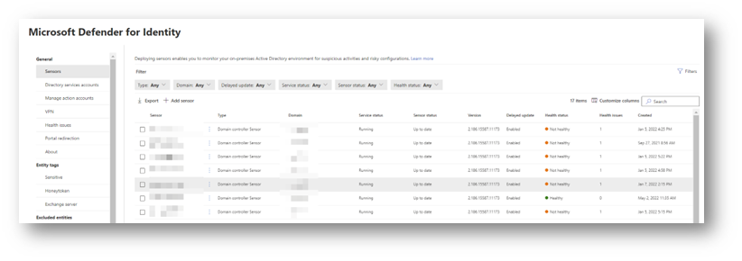
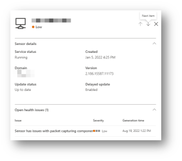
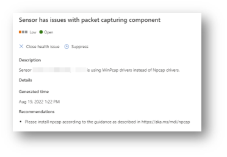
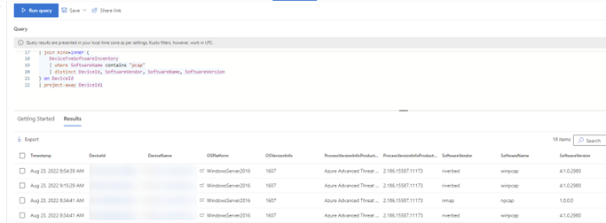
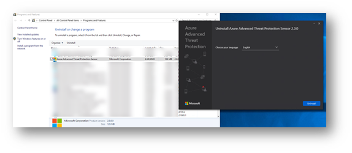
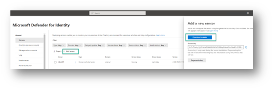
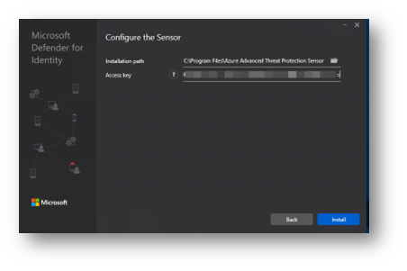
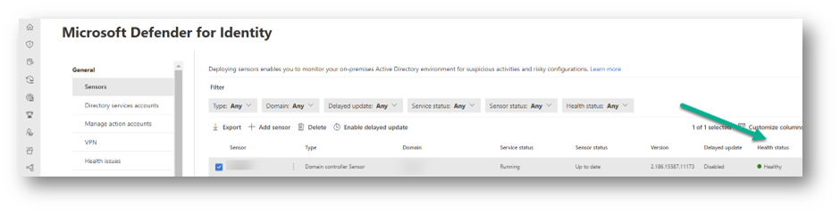

Hello everyone,

In July 2021 Microsoft [announced](https://techcommunity.microsoft.com/t5/microsoft-defender-for-identity/microsoft-defender-for-identity-and-npcap/m-p/2584151) that starting with MDI version [2.156](https://docs.microsoft.com/en-us/defender-for-identity/whats-new) they included the OEM version of the Npcap executable in the Sensor deployment package. The reason for doing so is because WinPcap is no longer supported and since it's no longer being developed, the driver cannot be optimized any longer for the Defender for Identity sensor. Additionally, if there is an issue in the future with the WinPcap driver, there are no options for a fix. More details can be found [here](https://docs.microsoft.com/en-us/defender-for-identity/technical-faq).

Since version [2.184](https://docs.microsoft.com/en-us/defender-for-identity/whats-new) released on July 10th 2022 the Defender for Identity installation package will now install the Npcap component instead of the WinPcap drivers.

Although the MDI Sensor does update itself, you will need to plan for this change and act yourself. If you haven't installed the Npcap driver already, you will notice that within the Microsoft Defender for Identity portal, sensors that use WinPcap show up as "Not healthy".

When opening the status page, you'll see the following information.

You can use [this advanced hunting query](https://github.com/alexverboon/MDATP/blob/master/AdvancedHunting/MDI%20-%20WinPcap%20-%20npcap.md) to get a quick overview of your domain controllers that have the WinPcap driver installed.

Okay, now that you have identified the domain controllers that require an update, here's what you need to do after you have received an internal approval for the change.

If you already installed the sensor with WinPcap and need to update to use Npcap:

1. **Uninstall the sensor.**
   *Lesson learned: when trying to uninstall via the Apps and Features UI on Windows Server 2019, I couldn't run the install, you really need to open the appwiz.cpl UI.*
   
2. **Uninstall WinPcap.**
3. **Reinstall the sensor** (with an installation package of version 2.184 or greater). This will also install the Npcap driver package. You can download the latest Sensor installation package from the MDI portal.
   
   
   Once the Sensor is installed, the Sensor will show up as healthy within the Defender for Identity portal.
   

For other scenarios see: [How do I download and install or upgrade the Npcap driver?](https://docs.microsoft.com/en-us/defender-for-identity/technical-faq)

Have a great day

Alex

