Hello there,

In this blog post we look at a setting within the Azure AD portal: "Users can create Azure AD tenants". Unfortunately, this setting is enabled by default. Most organizations will probably want to turn this off. You can find it in the Azure AD portal under Settings > Users > User settings > Tenant creation.

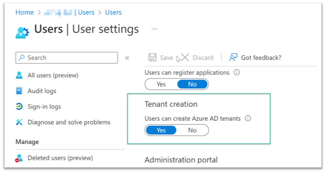

`Yes` allows default users to create Azure AD tenants. `No` allows only users with the Global Administrator or Tenant Creator roles to create Azure AD tenants. Anyone who creates a tenant becomes the Global Administrator for that tenant.

Let's look at what a standard user can do when the setting is enabled and they have access to the Azure AD portal. There is another setting that lets you [restrict access to the Azure AD administration portal](https://learn.microsoft.com/en-gb/azure/active-directory/fundamentals/users-default-permissions).

Select Manage tenants.

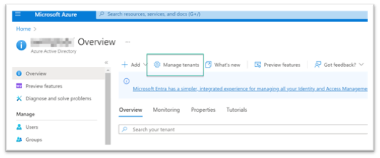

Then select Create.

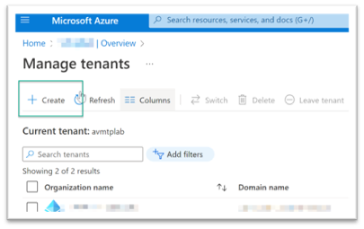

Select a tenant type.

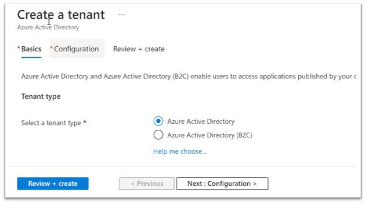

Finally, enter the name of the tenant.

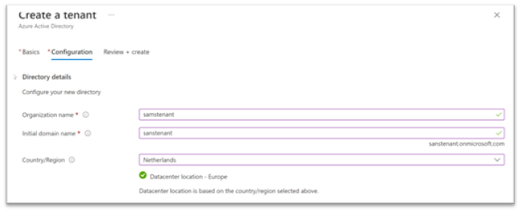

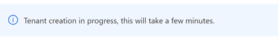

After a few minutes, Sam has its own tenant.

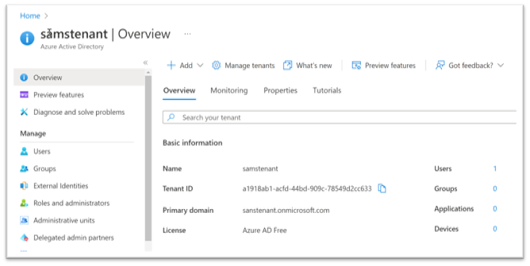

We also get an audit log for this activity with the activity type `Create Company`.

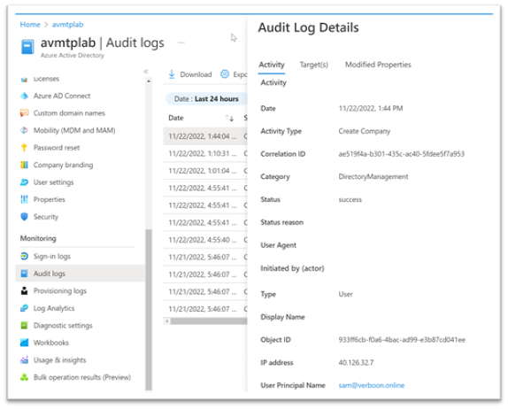

And we also get the Tenant ID that was created.

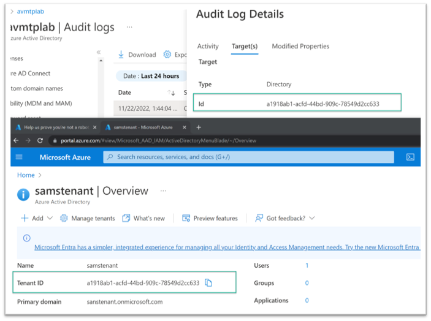

If you have not disabled the setting yet, here is a KQL query to check whether someone in your organization already created a tenant.

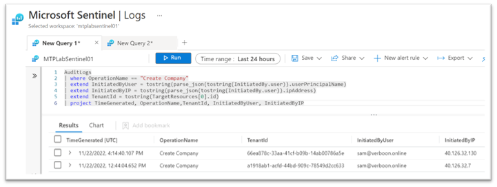

And here is another query to find who enabled the feature again after it was disabled.

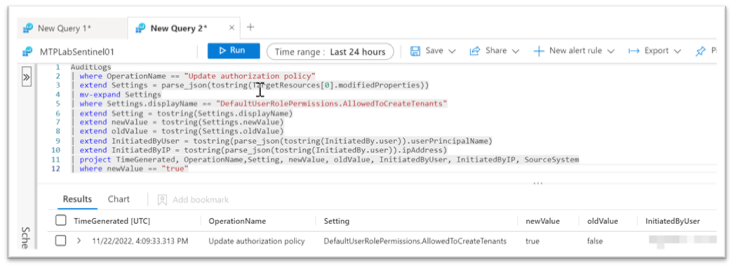

If you use Microsoft Sentinel, you can create analytic rules for both activities.

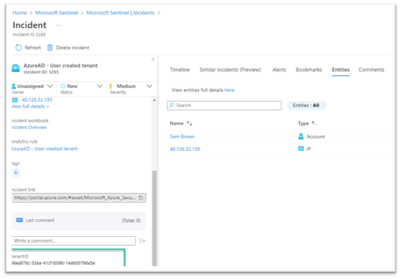

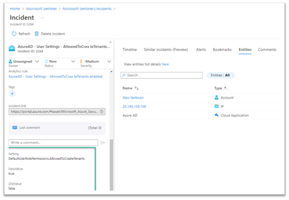

Below are the KQL queries.

```kusto
// New Azure AD Tenant created
AuditLogs
| where OperationName == "Create Company"
| extend InitiatedByUser = tostring(parse_json(tostring(InitiatedBy.user)).userPrincipalName)
| extend InitiatedByIP = tostring(parse_json(tostring(InitiatedBy.user)).ipAddress)
| extend TenantId = tostring(TargetResources[0].id)
| project TimeGenerated, OperationName, TenantId, InitiatedByUser, InitiatedByIP
```

```kusto
// AzureAD - Allow users to create tenants - enabled
AuditLogs
| where OperationName == "Update authorization policy"
| extend Settings = parse_json(tostring(TargetResources[0].modifiedProperties))
| mv-expand Settings
| where Settings.displayName == "DefaultUserRolePermissions.AllowedToCreateTenants"
| extend Setting = tostring(Settings.displayName)
| extend newValue = tostring(Settings.newValue)
| extend oldValue = tostring(Settings.oldValue)
| extend InitiatedByUser = tostring(parse_json(tostring(InitiatedBy.user)).userPrincipalName)
| extend InitiatedByIP = tostring(parse_json(tostring(InitiatedBy.user)).ipAddress)
| project TimeGenerated, OperationName, Setting, newValue, oldValue, InitiatedByUser, InitiatedByIP, SourceSystem
| where newValue == "true"
```
