# Windows Built-in local security groups

Windows has several built-in local security groups that are designed to manage permissions and access rights on a computer. These groups are predefined by Windows, and each group has specific rights and permissions. The exact groups available can vary depending on the version of Windows you're using or the features that are enabled, but here's a general overview of the most commonly found built-in local security groups in Windows systems:

- Administrators
- Users
- Guests
- Backup Operators
- Remote Desktop Users
- Network Configuration Operators
- Remote Management Users
- Power Users
- Access Control Assistance Operators
- Device Owners
- Distributed COM Users
- Event Log Readers
- Performance Log Users
- Performance Monitor Users

In an enterprise environment, usually only the following groups are used:

**Users** - This group is intended for regular users who do not need administrative privileges. Members can run installed applications and perform basic tasks but cannot make significant changes to the system settings or the security configuration.

When the device is joined to an Active Directory domain or Entra ID, the users account is automatically added to this group during their first login.

**Administrators** - Members of this group have full control of the computer and can make any changes, including adding other users to the administrator’s group, changing security settings, installing software, and accessing all files on the computer.

When the device is joined to Active Directory, only the Domain Admins group is added to the local Administrator group, when the device is joined into Entra ID, the following security principals are added to the local Administrators group:

- The Microsoft Entra Global Administrator role
- The Microsoft Entra Joined Device Local Administrator role.
- The user performing the Microsoft Entra join.

For more details read: [How to manage the local administrators group on Microsoft Entra joined devices](https://learn.microsoft.com/en-us/entra/identity/devices/assign-local-admin#manage-regular-users)

**Remote Desktop Users** - This group is for users who need to access the computer using Remote Desktop. Members can log on remotely but do not have administrative rights unless explicitly granted.

# Managing local security groups

In a managed enterprise environment, you want to have control over who has privileged access on your devices. When possible, avoid granting users permanent administrative rights by adding their account to the local Administrators group. Instead, for ad-hoc activities that require elevated permissions, consider using [Windows LAPS](https://learn.microsoft.com/en-us/windows-server/identity/laps/laps-overview), [Microsoft Intune Endpoint Privilege Management (EPM)](https://learn.microsoft.com/en-us/mem/intune/protect/epm-overview), or managing the [local Administrator group membership with Group Policy Preferences](https://techcommunity.microsoft.com/t5/core-infrastructure-and-security/using-group-policy-preferences-to-manage-the-local-administrator/ba-p/259223) so that you have central control over these permissions.

# The Risk of unmanaged local security group memberships

The risk of users with local administrative and/or remote access are obvious but let me summarize some of them.

- **Malware and Ransomware**: Users with administrative rights are more susceptible to malware and ransomware attacks.
- **Accidental or Deliberate System Changes:** With full system access, an administrator can unintentionally change or delete critical system files or settings, potentially leading to system instability, data loss, or exposure of sensitive information.
- **Lateral Movement** - Once an attacker gains the credentials of a local administrator account, they can use those privileges to explore and compromise other systems within the network. If you have Defender for Identity deployed, I suggest you read [Understand and investigate Lateral Movement Paths (LMPs) with Microsoft Defender for Identity](https://learn.microsoft.com/en-us/defender-for-identity/understand-lateral-movement-paths)
- **RDP as a Target** - RDP is a common target for attackers. Systems with open RDP ports (especially those [exposed to the internet](https://learn.microsoft.com/en-us/microsoft-365/security/defender-endpoint/internet-facing-devices?view=o365-worldwide)) are at a higher risk of brute force attacks, where attackers attempt to guess passwords to gain unauthorized access.
- **Credential Harvesting**: Once attackers gain access to a system via RDP, they can potentially use tools to harvest credentials stored on the system, enabling further attacks both on the local system and across the network.

# Monitoring local security group membership additions

Assuming you have processes in place for managing access to local security groups, you also want to monitor what is going on in your environment to identify real threat actors or internal staff, that, let’s put this nicely, bypasses your security controls.

With Microsoft Defender for Endpoint deployed, we can use advanced hunting to detect when a user was added to a security-enabled local group and look for the ActionType **UserAccountAddedToLocalGroup**, in simple words, a translation of the Event [4732  A member was added to a security-enabled local group](https://learn.microsoft.com/en-us/windows/security/threat-protection/auditing/event-4732).

```kql
DeviceEvents
| where ActionType == 'UserAccountAddedToLocalGroup'
```

When looking at the event details we see the following

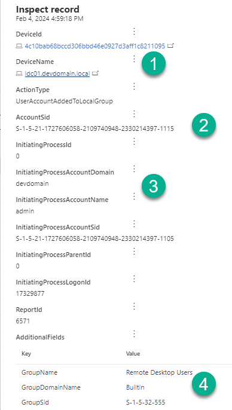

1. The device name where the user was added to a local group.
2. The AccountSID of the User that was added to the local group.
3. The User Account name, domain and SID that performed the action.
4. The Group name and SID of the local Group

Now if you run the above script in your lab or a small environment, you might recognize the account names, and maybe even the SIDs 😊 But what if you run this in a real enterprise environment?

Also keep in mind, that there are quite a few scenarios for adding users to a local group, provided the user has the permission to do so.

- A local user can add themselves or another local user to a local group.
- A Domain User can add themselves or another local or domain user to a local group.
- An Entra User can add themselves or another local or Entra ID user to a local group.

You will end up with something like shown in the example below.

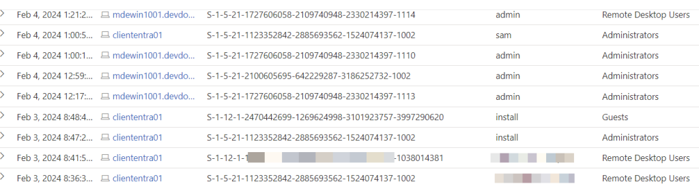

As mentioned above, we don’t get the friendly name of the user that was added to the group, but only their AccountSID. When you look closely, you’ll notice different patterns of the SID, this is because as mentioned previously there are several scenarios that can occur, i.e. whether the added user is a local user, an Active Directory User or an Entra ID user.

I wanted to have something that is easier to read, so I started working on a KQL query that enriches the information accordingly.

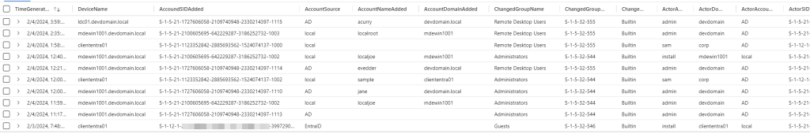

Let me walk you through the query in detail.

**Important**: The below query example is for use in Microsoft Sentinel, you will find the link to both queries for Defender XDR and Sentinel at the end of the post.

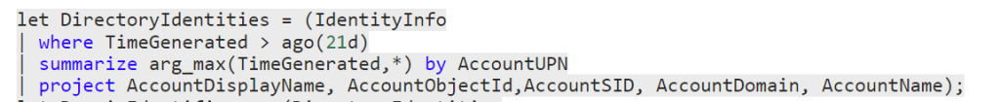

Retrieve all Identities from the **IdentityInfo** table and store them in a variable, we use this information later to join it with the results. Note that you must have Defender for Identity enabled in Defender XDR and when using the query in Microsoft Sentinel, you must configure the synchronization within the UEBA options.

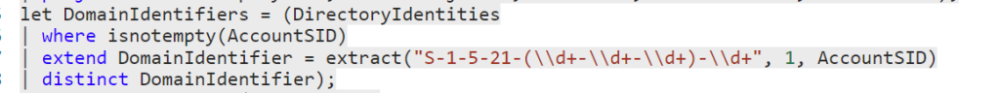

Here we are trying to determine the Active Directory Domain identifiers, and we use this later to find out whether the account is an AD-based account.

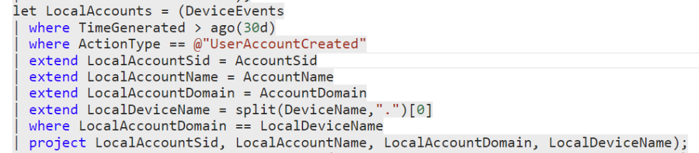

Here we’re retrieving information about local accounts that were created so that we can later enrich the SIDs that relate to local accounts, since we don’t have information about them in the IdentityInfo table.

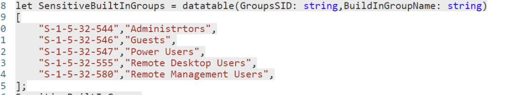

Here we define the SIDs and Group Names of the Windows built-in local security groups.

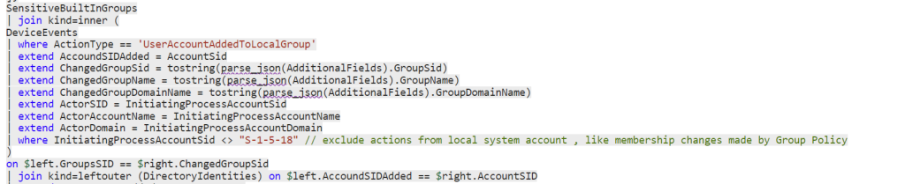

Now we are getting all events where any of the defined groups was changed. We exclude any actions that originate from the SID **S-1-5-18**, so we avoid the noise from local group membership changes originating from Windows LAPS or Group Policy.

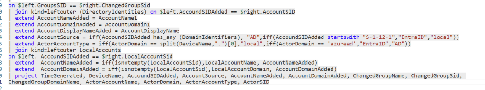

And finally, we add some other attributes that should help to provide context whether the added account is a local, domain or Entra Account and the source of the account who performed the action.

Let’s take a look at the results.

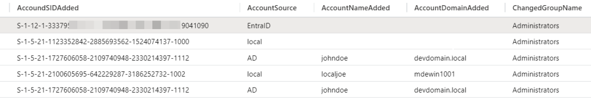

In the first record, where the **AccountSource** is Entra ID, we can’t see the name of the User that was added, this is because the event only stores the SID, but we can’t find that SID in the IdentityInfo table, so the only way to identify the user is to convert the user’s Entra ID SID to the Object ID. Since we can’t do this in KQL, we have to do this elsewhere like [https://erikengberg.com/azure-ad-sid-to-object-id/](https://erikengberg.com/azure-ad-sid-to-object-id/)

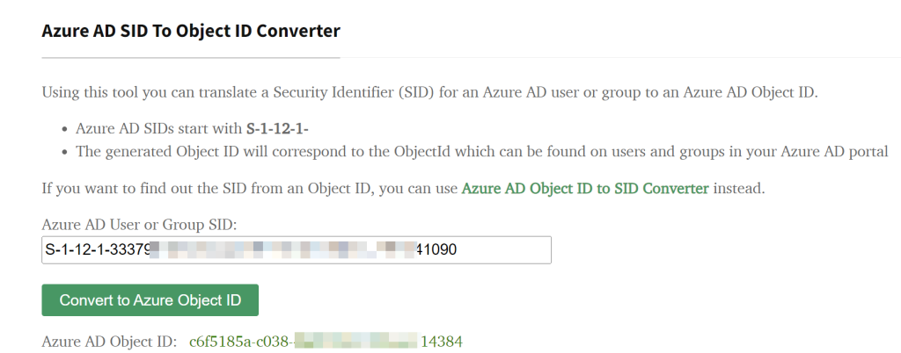

When we have the ObjectID, we can do a further search to find the Users friendly name.

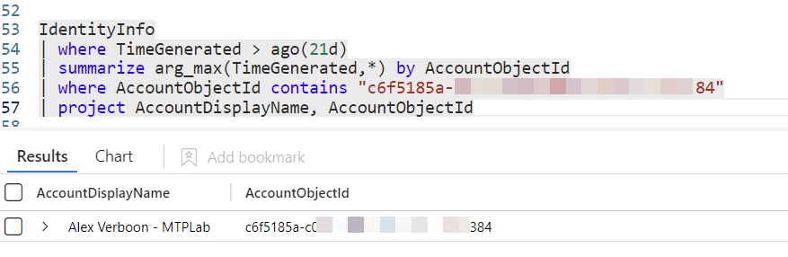

When looking at the records where the **AccountSource** is Local, we see one record with a Username and one without. For the record without the name, we were unable to retrieve the information from historical user creation events (unless we would increase the lookback period, which would consume a lot of query resources). In this case, you will have to search for the account with the corresponding SID locally on the device. This can be done by collecting an [investigation package](https://learn.microsoft.com/en-us/microsoft-365/security/defender-endpoint/respond-machine-alerts?view=o365-worldwide#collect-investigation-package-from-devices) or running a [live response session](https://learn.microsoft.com/en-us/microsoft-365/security/defender-endpoint/respond-machine-alerts?view=o365-worldwide#initiate-live-response-session) in Microsoft Defender for Endpoint.


For Active Directory accounts, it is usually quite simple to correlate the SID with the actual user, provided the account information is visible within the IdentityInfo table.


To enrich the Actor information (so the Identity that added the user), we basically do the same as described above.

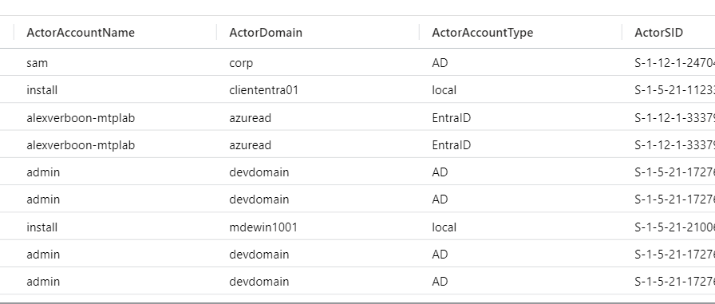

I hope this will help you to monitor or proactively hunt for Windows built-in local security group changes. In an upcoming post, we’ll investigate monitoring Active Directory and Entra ID group changes.

You can find the queries in my GitHub repository here.

[Hunting-Queries-Detection-Rules/Defender For Endpoint/MDE-WindowsBuiltInGroupMemberChanges.md at main · alexverboon/Hunting-Queries-Detection-Rules (github.com)](https://github.com/alexverboon/Hunting-Queries-Detection-Rules/blob/main/Defender%20For%20Endpoint/MDE-WindowsBuiltInGroupMemberChanges.md)

Additional References

[Security identifiers | Microsoft Learn](https://learn.microsoft.com/en-us/windows-server/identity/ad-ds/manage/understand-security-identifiers/?wt.mc_id=AZ-MVP-5003805)

[Local Accounts - Windows Security | Microsoft Learn](https://learn.microsoft.com/en-us/windows/security/identity-protection/access-control/local-accounts//?wt.mc_id=AZ-MVP-5003805)

[Security guidance for remote desktop adoption | Microsoft Security Blog](https://www.microsoft.com/en-us/security/blog/2020/04/16/security-guidance-remote-desktop-adoption/)

[Azure AD SID to Object ID Converter - ErikEngberg.com](https://erikengberg.com/azure-ad-sid-to-object-id/)

[Identify internet-facing devices in Microsoft Defender for Endpoint | Microsoft Learn](https://learn.microsoft.com/en-us/microsoft-365/security/defender-endpoint/internet-facing-devices?view=o365-worldwide//?wt.mc_id=AZ-MVP-5003805)


