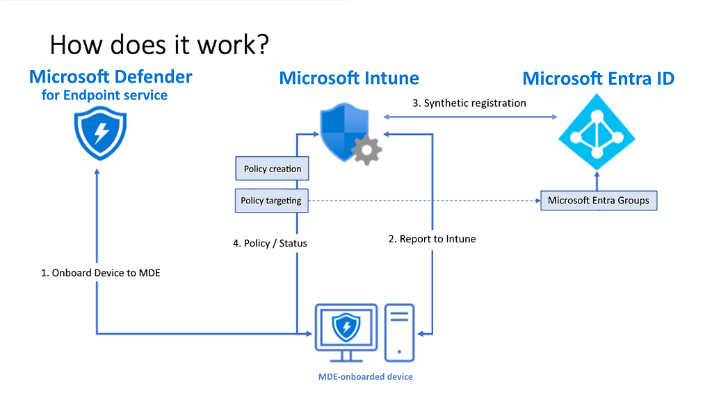
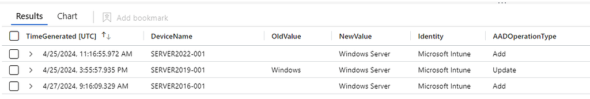
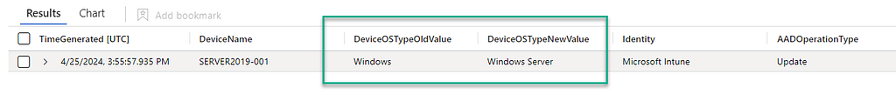
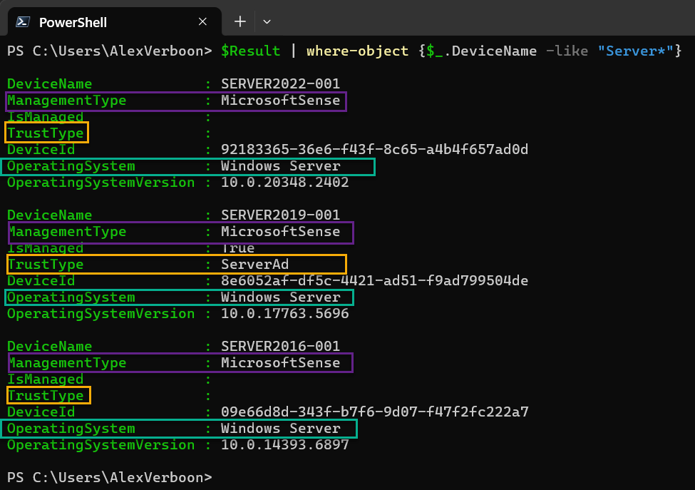
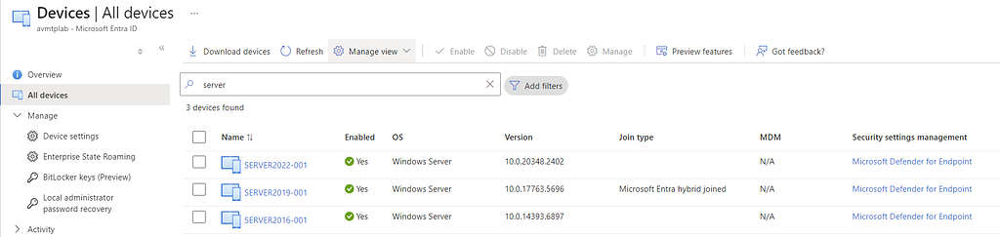
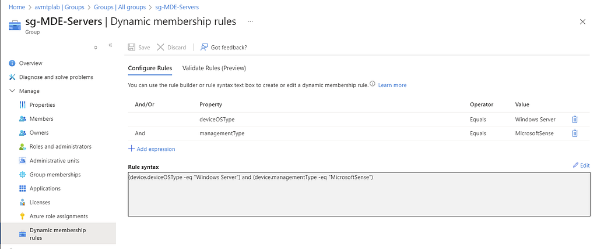
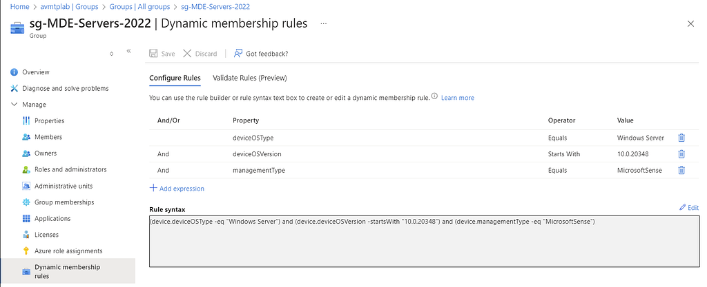
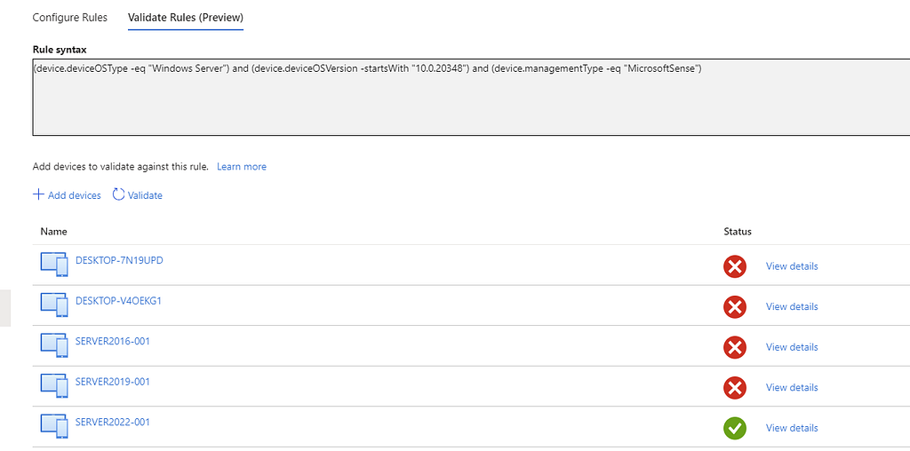

In this post, we take a closer look at how **Microsoft Defender for Endpoint Security Settings Management** works behind the scenes, especially for Windows Server scenarios.

## Entra ID Device Registration

Because Intune policy assignment is group-based, devices need an object in Entra ID. If a server already has an existing registration (for example Hybrid Join), that object is reused. If not, a synthetic device identity is created in Entra ID so the device can retrieve policy.

This is especially useful for Windows Servers and other scenarios where traditional Intune enrollment is not available.



You can investigate this process in Entra audit logs. Example query:

```kusto
AuditLogs
| where OperationName == 'Update device' or OperationName == 'Add device'
| where Identity == "Microsoft Intune"
| extend modifiedProperties = parse_json(TargetResources)[0].modifiedProperties
| mv-expand modifiedProperties
| where modifiedProperties.displayName == "DeviceOSType"
| extend OldValue = tostring(parse_json(tostring(modifiedProperties.oldValue))[0])
| extend NewValue = tostring(parse_json(tostring(modifiedProperties.newValue))[0])
| extend DeviceName = tostring(TargetResources[0].displayName)
| project TimeGenerated, DeviceName, OldValue, NewValue, Identity, AADOperationType
```



## Windows Server deviceOSType behavior

When Windows Servers are managed through Defender for Endpoint Security Settings Management, `deviceOSType` is updated to **Windows Server**. This makes policy targeting more accurate than older generic `Windows` values.



To inspect device properties, you can collect details with Microsoft Graph PowerShell.

```powershell
$Result = [System.Collections.ArrayList]::new()
$AllDevices = Get-MgDevice -All
foreach ($Device in $AllDevices) {
    $DeviceDetail = $Device.AdditionalProperties
    $object = [PSCustomObject]@{
        DeviceName             = $Device.DisplayName
        ManagementType         = $DeviceDetail.managementType
        EnrollmentType         = $DeviceDetail.enrollmentType
        SystemLabels           = $Device.Systemlabels
        IsManaged              = $Device.isManaged
        TrustType              = $Device.trustType
        DeviceId               = $Device.DeviceId
        OperatingSystem        = $Device.OperatingSystem
        OperatingSystemVersion = $Device.OperatingSystemVersion
    }
    [void]$Result.Add($object)
}
$Result | Where-Object { $_.DeviceName -like "Server*" }
```



In the Entra portal, you can also validate these objects directly.



## Entra ID Dynamic Groups

To ensure all Defender-managed servers receive policy, use dynamic groups based on `deviceOSType` and `managementType`.

Baseline group example for all Windows Servers managed by Defender:

```text
(device.deviceOSType -eq "Windows Server") and (device.managementType -eq "MicrosoftSense")
```



For version-specific groups, add `deviceOSVersion` filters.

Example for Server 2022:

```text
(device.deviceOSType -eq "Windows Server") and (device.deviceOSVersion -startsWith "10.0.20348") and (device.managementType -eq "MicrosoftSense")
```



Validate the rule before applying it broadly.



Using OS-version-specific groups is useful when policy settings vary by Windows Server release.
