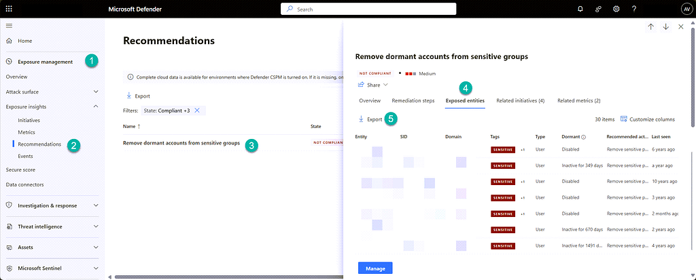
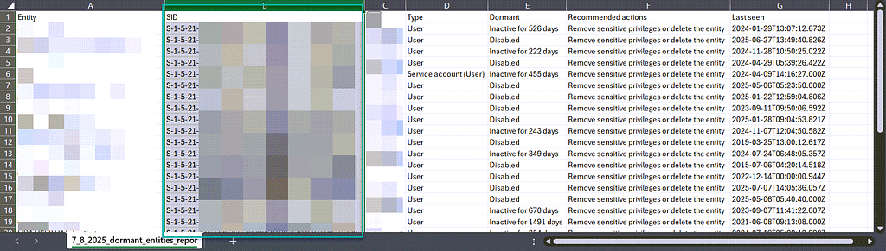
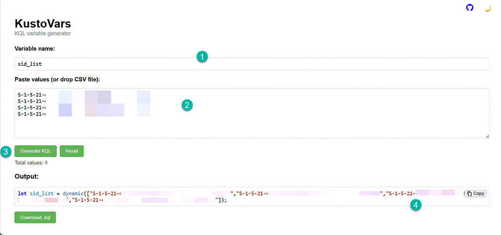
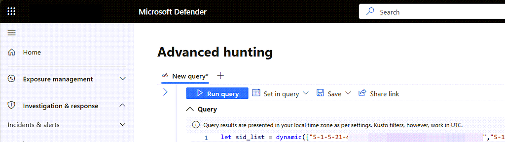
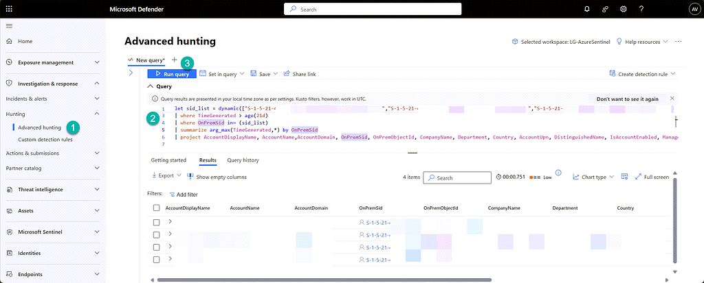

Dormant sensitive accounts are a high-risk identity exposure. In Microsoft Defender XDR, the recommendation **Remove dormant accounts from sensitive groups** helps surface these accounts, including whether they are inactive, disabled, or have expired credentials.



You can export the detected entities, but the export often contains limited context. In many cases, you only get entity names or SID values, which makes remediation harder when you need ownership and organizational details.



A practical approach is to use the SID values to enrich the result set with identity attributes from `IdentityInfo`. You can quickly build a SID variable list using KustoVars, then query Defender XDR for additional context.





Use the following query under your SID variable block:

```kusto
IdentityInfo
| where TimeGenerated > ago(21d)
| where OnPremSid in~ (sid_list)
| summarize arg_max(TimeGenerated,*) by OnPremSid
| project AccountDisplayName, AccountName, AccountDomain, OnPremSid,
          OnPremObjectId, CompanyName, Department, Country,
          AccountUpn, DistinguishedName, IsAccountEnabled, Manager
```



With this enriched view, you can quickly assess account purpose, ownership, and placement before taking action. That makes it easier to decide whether dormant sensitive accounts should be disabled, cleaned up, or removed from sensitive groups.
