Microsoft Entra Connect Sync now includes an admin audit logging capability that is enabled by default. This gives organizations visibility into configuration changes performed by Global Administrators, Hybrid Administrators, and local server administrators.

In this post, we walk through how to forward those Microsoft Entra Connect Sync audit events into Microsoft Sentinel for centralized monitoring and investigation.

## Check the Microsoft Entra Connect Sync Version

In the Entra portal, go to Entra Connect > Connect Sync > Microsoft Entra Connect Health > Sync Services > your service > Microsoft Entra Connect Servers > your server > Properties > Synchronization.

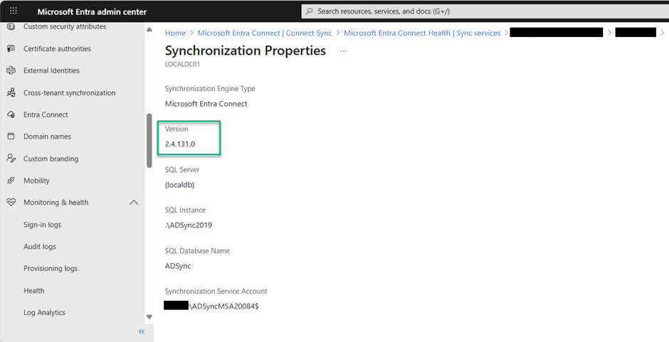

You can also verify the version locally on the Entra Connect Sync server.

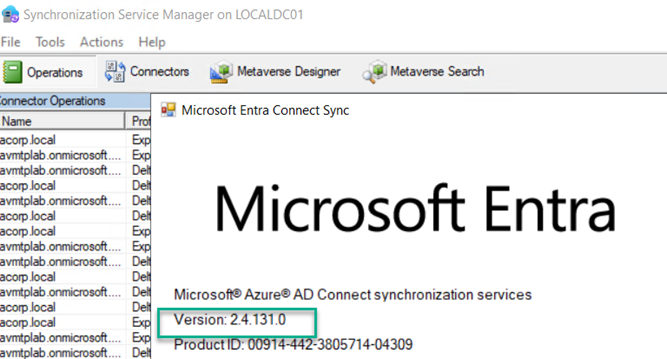

## Audit Logs

In Windows Event Viewer, you can review Microsoft Entra Admin Actions events.

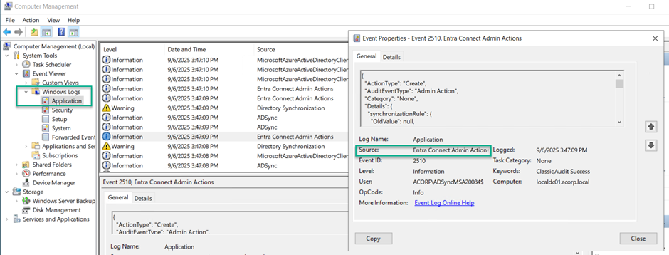

## Azure Monitor Agent

The Azure Monitor Agent (AMA) collects telemetry and sends it to your Log Analytics workspace. If the Entra Connect Sync server is on-premises, onboard it to Azure Arc first, then enable the appropriate data collection rule.

## Microsoft Sentinel - Windows Security Events via AMA

To forward Windows security events to Sentinel, use the Windows Security Events via AMA connector from Content Hub.

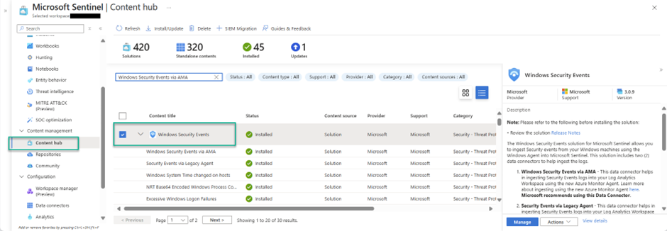

Open the connector configuration and create a data collection rule.

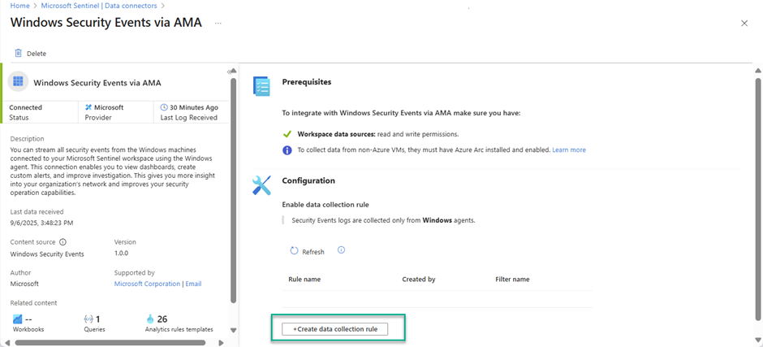

Provide a name, subscription, and resource group.

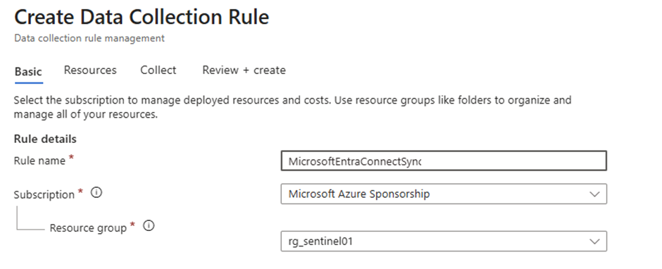

On the Resources tab, select the server running Entra Connect Sync.

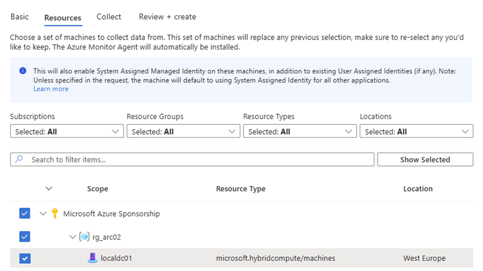

On the Collect tab, choose Custom and add these XPath queries:

```text
Application!*[System[Provider[@Name='Entra Connect Admin Actions'] and (EventID=2523 or EventID=2524 or EventID=2525 or EventID=2526)]]
Application!*[System[Provider[@Name='Entra Connect Admin Actions'] and (EventID=2503 or EventID=2504 or EventID=2505 or EventID=2506 or EventID=2507 or EventID=2508 or EventID=2509 or EventID=2510 or EventID=2511 or EventID=2512 or EventID=2513 or EventID=2514 or EventID=2515 or EventID=2516 or EventID=2517 or EventID=2518 or EventID=2519 or EventID=2520)]]
Application!*[System[Provider[@Name='Entra Connect Admin Actions'] and (EventID=2521 or EventID=2522)]]
```

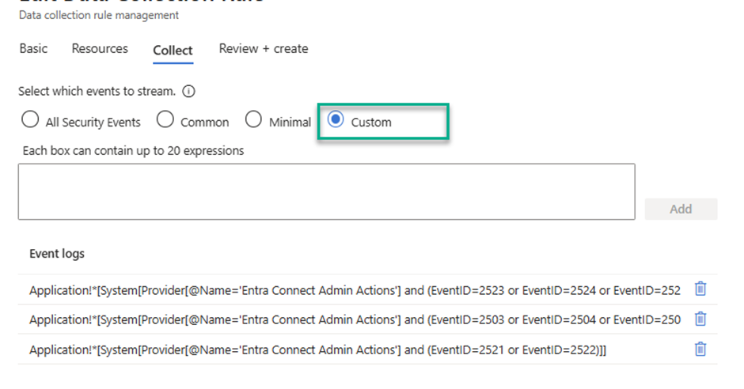

Review the settings and create the rule.

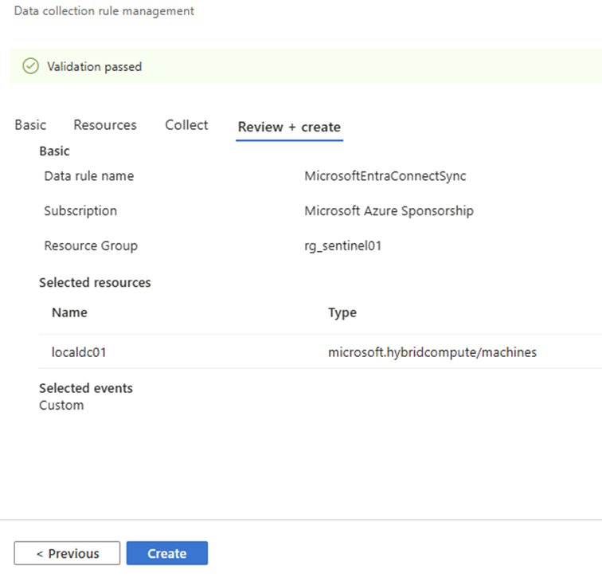

Once deployed, the AMA extension is installed on the server.

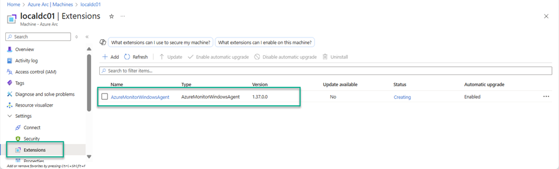

After onboarding, Entra Connect Sync admin action events are forwarded to Sentinel and are queryable from Log Analytics.

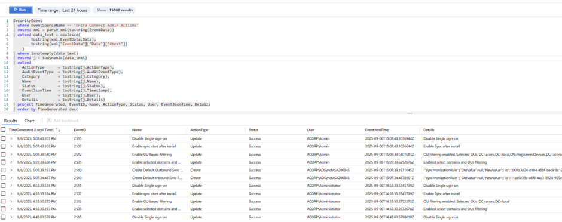

Happy auditing!

## References

- [Microsoft Entra Connect admin audit logging](https://learn.microsoft.com/en-us/entra/identity/hybrid/connect/admin-audit-logging)
- [Windows Security Events via AMA connector](https://learn.microsoft.com/en-us/azure/sentinel/connect-windows-security-events)
- [Hunting query: EntraConnectSyncAuditEvents](https://github.com/alexverboon/Hunting-Queries-Detection-Rules/blob/main/Entra%20ID/EntraID-EntraConnectSyncAuditEvents.md)

