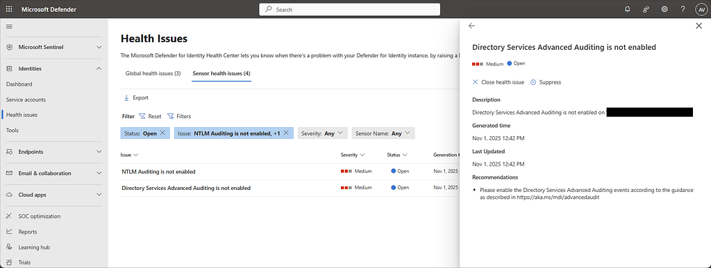
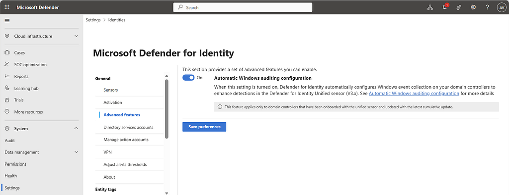
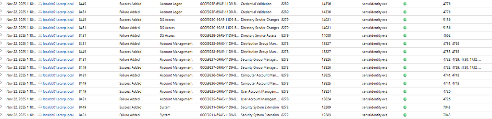
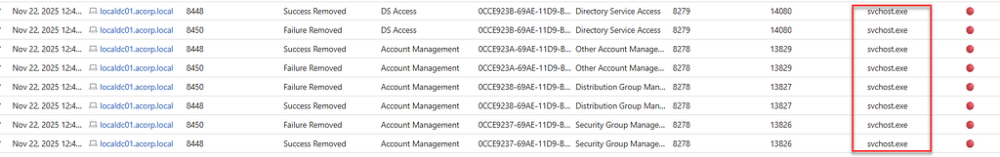
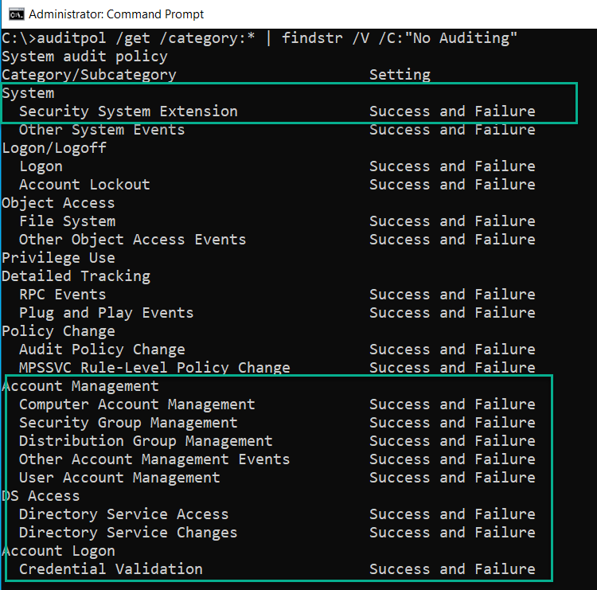

One of the most common issues we encounter during Defender for Identity assessments is misconfiguration. Many organizations assume that installing the sensor is the final step, but proper post-installation configuration is just as important.

In particular, enabling the required Windows event auditing policies is essential for full detection capabilities. Without these settings, functionality is degraded and health notifications start to appear.



Defender for Identity relies on specific Windows audit categories and subcategories to capture critical events.

- **Account Logon**
  - Audit Credential Validation, Event ID 4776
- **Account Management**
  - Audit Computer Account Management, Event IDs 4741 and 4743
  - Audit Distribution Group Management, Event IDs 4753 and 4763
  - Audit Security Group Management, Event IDs 4728, 4729, 4730, 4732, 4733, 4756, 4757, 4758
  - Audit User Account Management, Event ID 4726
- **DS Access**
  - Audit Directory Service Changes, Event ID 5136
  - Audit Directory Service Access, Event ID 4662
- **System**
  - Audit Security System Extension, Event ID 7045

## Automatic Windows Event Auditing Configuration

To address this challenge, Microsoft introduced **Automatic Windows Event Auditing Configuration**. With Defender for Identity sensor v3.x, the required auditing settings can be configured automatically on domain controllers.

This applies both to new sensors and to existing sensors with missing or incorrect auditing configuration.

To enable this feature in the Defender XDR portal, go to:

- Settings
- Identities
- Advanced features



After enabling the feature, you can validate the result by running the query published here:

- [MDI Automatic Windows auditing configuration query](https://github.com/alexverboon/Hunting-Queries-Detection-Rules/blob/main/Defender%20For%20Identity/MDI-Automatic%20Windows%20auditing%20configuration.md)



Pay attention to `InitiatingProcessFileName`. If the change was made by `senseidentity.exe`, the automatic configuration is working as expected. If you see `svchost.exe`, there is often a Group Policy conflict.



If behavior is inconsistent, also check for leftover local policy configuration:

```text
C:\Windows\System32\GroupPolicy\Machine\Microsoft\Windows NT\Audit\audit.csv
```

You can additionally verify current audit policy settings with:

```text
auditpol /get /category:* | findstr /V /C:"No Auditing"
```



## References

- [Hunting query: MDI Automatic Windows auditing configuration](https://github.com/alexverboon/Hunting-Queries-Detection-Rules/blob/main/Defender%20For%20Identity/MDI-Automatic%20Windows%20auditing%20configuration.md)
- [MC1187403 - Automatic Windows event auditing configuration now available for unified sensors (v3.x)](https://mc.merill.net/message/MC1187403)
- [Configure audit policies for Windows event logs - Microsoft Defender for Identity](https://learn.microsoft.com/en-us/defender-for-identity/deploy/configure-windows-event-collection#configure-windows-event-auditing-with-the-defender-for-identity-sensor-v3x)
- [What's new - Microsoft Defender for Identity](https://learn.microsoft.com/en-us/defender-for-identity/whats-new)
- [Configure advanced audit policy settings from the UI](https://learn.microsoft.com/en-us/defender-for-identity/deploy/configure-windows-event-collection#configure-advanced-audit-policy-settings-from-the-ui)
