Despite rapid OS refresh cycles, many organizations continue to run older systems such as Windows 7 or Windows Server 2008 R2. In many cases, critical line-of-business applications only run on older frameworks, specialized production machines rely on vendor-locked drivers, or long hardware replacement cycles make immediate upgrades unrealistic. Some companies also operate regulated or validated environments where any OS change requires extensive re-certification.

Until now, these legacy endpoints posed a persistent security risk because unsupported or limited protection allowed attackers to exploit vulnerabilities with little resistance.

This situation has changed with the recent Microsoft Defender for Endpoint announcement that extends stronger protection to Windows 7 and Server 2008 R2 devices. With this update, organizations can bring legacy systems under the same modern and proactive security umbrella as newer OS versions, reducing risk without forcing immediate migration.

Microsoft Defender for Endpoint has supported Windows 7 and Windows Server 2008 R2 for years, but this support previously relied on MMA together with the SCEP client. Because Defender for Endpoint operated only as a process-based sensor on these legacy systems, detection and response capabilities were more limited than on modern OS versions where Defender is deeply integrated.

Below is an overview of key Defender for Endpoint capabilities now available for these legacy systems.

- Advanced Hunting with KQL
- Antivirus in passive mode
- Custom file indicators
- Device and file response capabilities
- Next-generation protection
- OS and software vulnerability assessments
- Security settings management
- Sense detection sensor
- Attack disruption (contain device or IP)

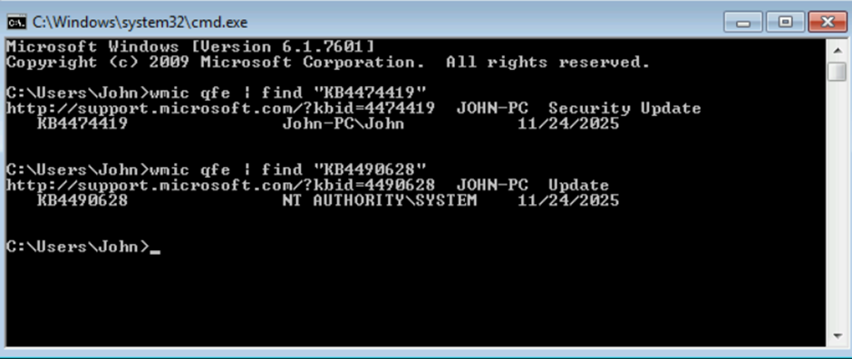

## Onboarding Windows 7

### Prerequisites

To deploy Microsoft Defender for Endpoint with the new deployment tool, devices must meet several prerequisites.

- Administrative privileges are required.
- Tenant preview features must be enabled.
- Devices need connectivity to `definitionupdates.microsoft.com` and Defender service endpoints.
- Windows 7 SP1 and Server 2008 R2 SP1 require 64-bit editions.
- Keep the systems patched with current updates.
- Required updates include KB4474419 and KB4490628.
- Server 2008 R2 SP1 also requires .NET Framework 3.5 or later.

Source:
[Defender deployment tool prerequisites](https://learn.microsoft.com/en-us/defender-endpoint/defender-deployment-tool-windows#prerequisites)

Run the following commands to verify required KB updates are present:

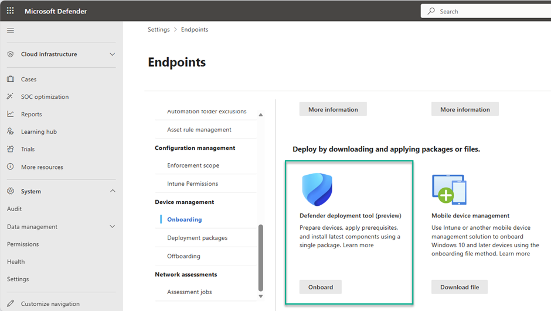

### Defender Deployment Tool

In the Microsoft Defender portal, go to System > Settings > Endpoints > Onboarding and choose Windows (preview). Under deployment options, download the package.

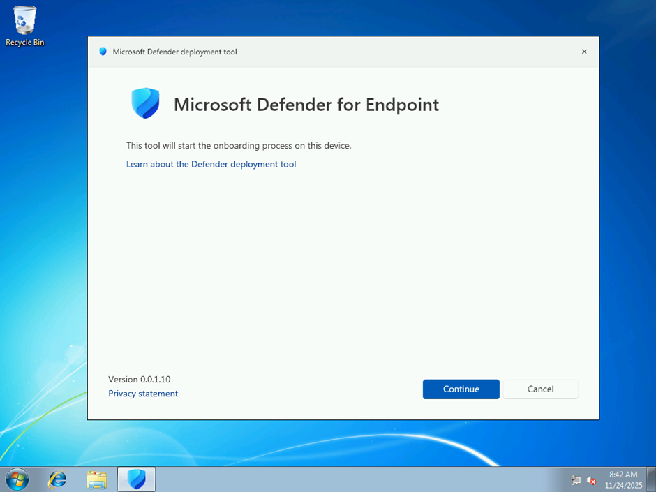

The Defender Deployment Tool supports interactive and non-interactive modes.

[Deploy Defender Endpoint security on devices](https://learn.microsoft.com/en-us/defender-endpoint/defender-deployment-tool-windows#deploy-defender-endpoint-security-on-devices)

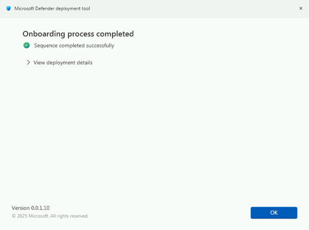

After reboot, the installation is completed.

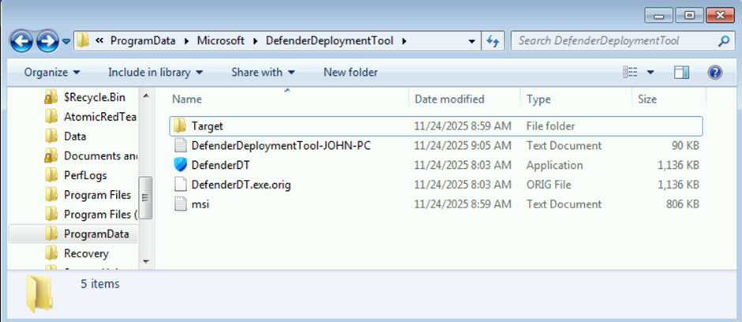

If you encounter issues, review logs at:

```text
C:\ProgramData\Microsoft\DefenderDeploymentTool
```

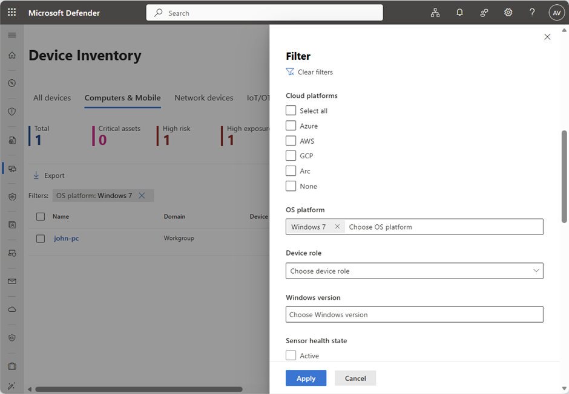

When onboarding succeeds, the device appears in the device inventory.

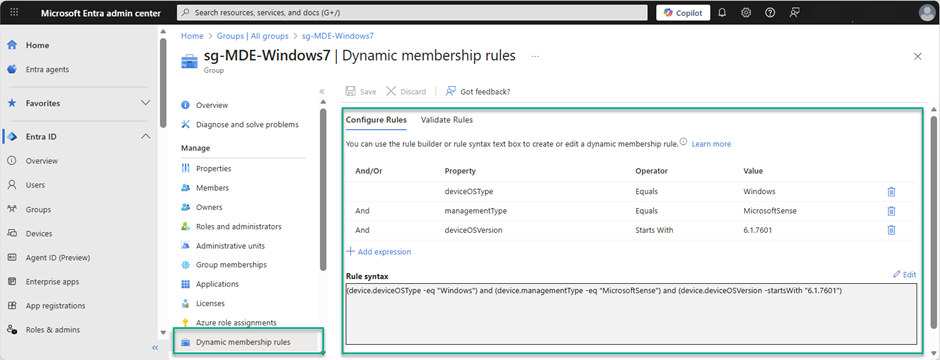

### Security Settings Management

Security Settings Management is supported, allowing centralized control for Defender settings such as exclusions and update schedules.

To target Windows 7 devices, use a dedicated Entra dynamic security group with a rule like:

```text
(device.deviceOSType -eq "Windows") and (device.managementType -eq "MicrosoftSense") and (device.deviceOSVersion -startsWith "6.1.7601")
```

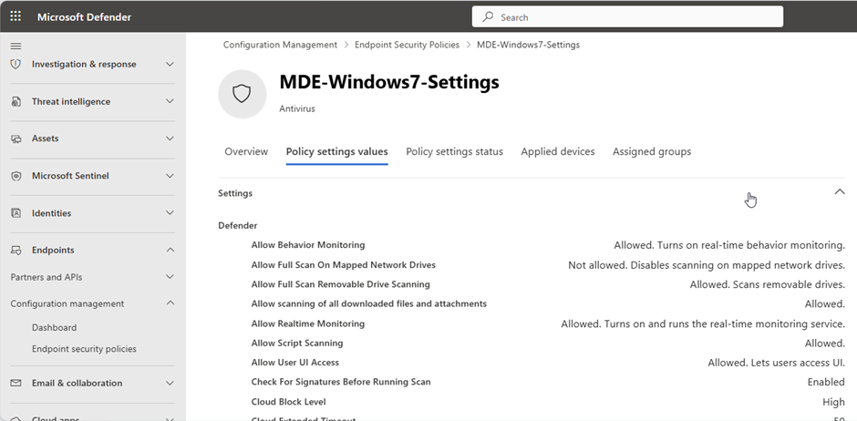

Create and assign a dedicated policy for the Windows 7 group.

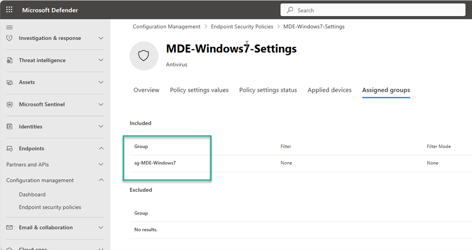

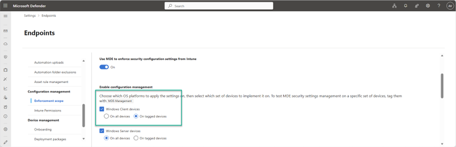

Depending on your enforcement scope, you may need to tag the device before registration in Entra ID and Intune.

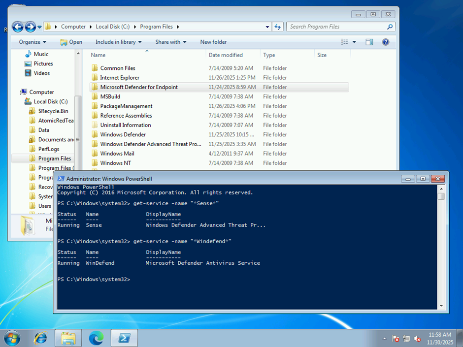

For more details:
[MDE security settings management](https://learn.microsoft.com/en-us/defender-endpoint/mde-security-settings-management)

## Defender for Endpoint on Windows 7

Microsoft Defender for Endpoint is now deeply integrated and has a footprint closer to newer Windows versions. Defender Antivirus and Defender for Endpoint run as services.

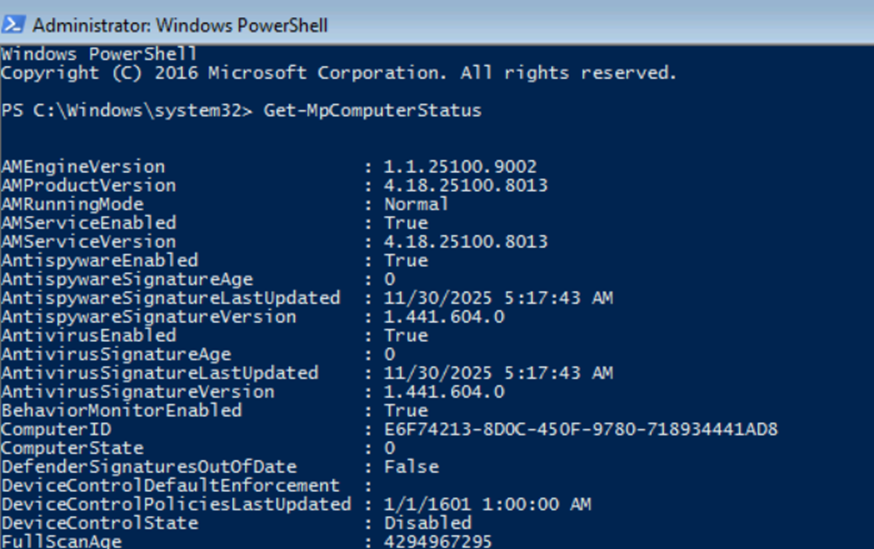

There is no local AV GUI, but settings can be viewed and managed locally with PowerShell 5.1.

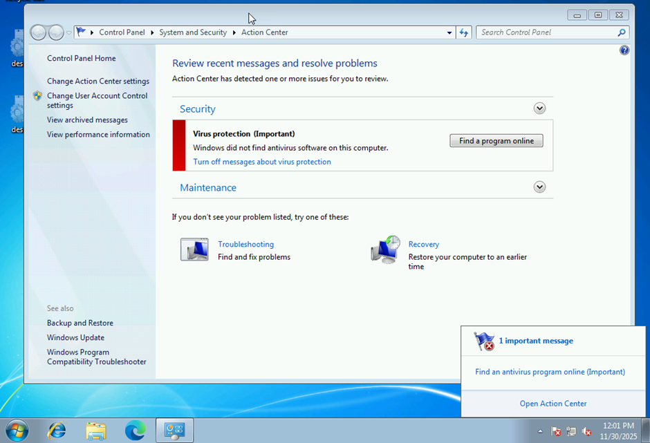

On some devices you may still see Action Center warnings that no antivirus is found. This is a known behavior and not necessarily an issue.

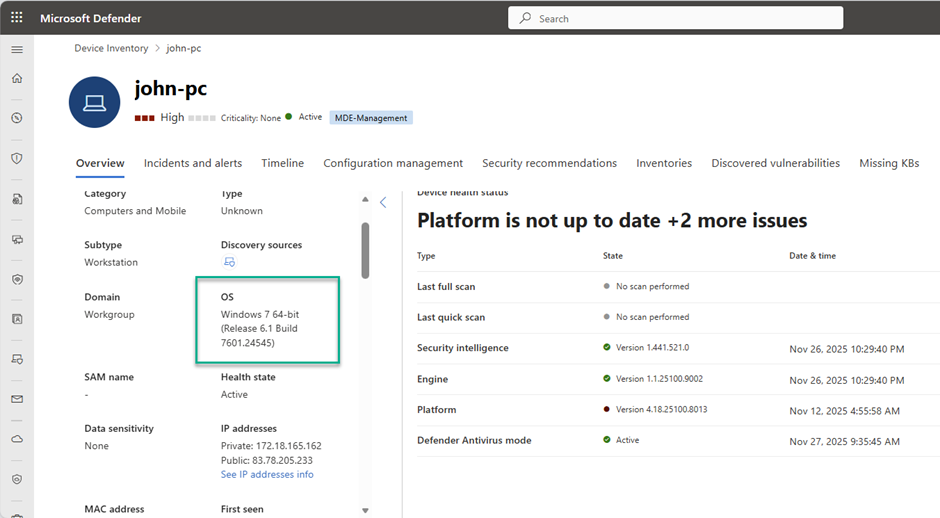

### Inventory and Vulnerability Management

After successful onboarding, the device starts sending inventory data, including installed software and missing updates.

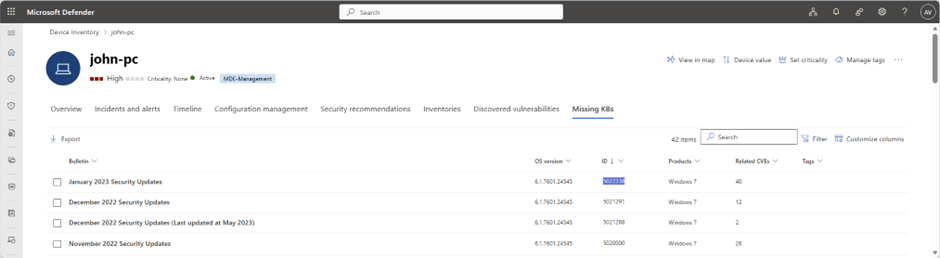

### Detection and Response

To validate detections, Atomic Red Team simulations can be used. In this scenario, Defender for Endpoint detected threats, initiated attack disruption, and contained affected accounts.

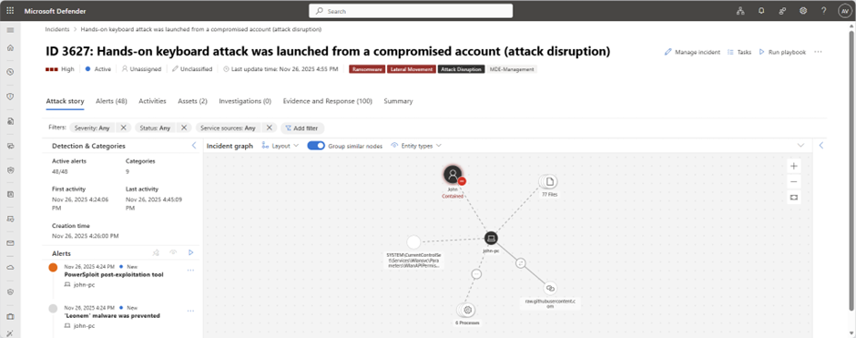

## Conclusion

If you still run Windows 7 or Server 2008 R2 in your environment, this is a good time to onboard them into Defender for Endpoint and reduce legacy risk.

## References

- [Expanded Defender support for legacy Windows devices](https://techcommunity.microsoft.com/blog/microsoftdefenderatpblog/ignite-2025-microsoft-defender-now-prevents-threats-on-endpoints-during-an-attac/4470805)
- [Onboard previous versions of Windows](https://learn.microsoft.com/en-us/defender-endpoint/onboard-downlevel)
- [Defender deployment tool (preview)](https://learn.microsoft.com/en-us/defender-endpoint/defender-deployment-tool-windows)
- [Endpoint security in the AI era: What is new in Defender](https://www.youtube.com/watch?v=5FvIbLwRqzg)
- [Known issues and limitations for Windows 7 SP1 and Server 2008 R2 SP1](https://learn.microsoft.com/en-us/defender-endpoint/defender-deployment-tool-windows#known-issues-and-limitations-for-windows-7-sp1-and-windows-server-2008-r2-sp1)

