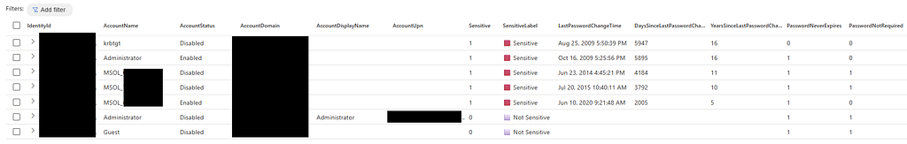

Recently Microsoft Defender XDR introduced a new table called [IdentityAccountInfo](https://learn.microsoft.com/en-us/defender-xdr/advanced-hunting-identityaccountinfo-table), and this one immediately caught my attention. It brings several interesting attributes into Advanced Hunting, including `LastPasswordChangeTime` and even the sensitivity classification of an identity.

Naturally, my first thought was: this is perfect material for some hunting logic, so let's build a KQL query out of it.

Why am I excited about this? Because it finally allows us to query identity hygiene data straight from Defender. No external inventory dumps, no AD scripting, just KQL.

Think of use cases like:

- **Identify stale passwords**  
  Detect accounts that have not changed their password for a long period. The query calculates this in days and years for easier reporting.
- **Assess sensitivity levels**  
  Determine whether accounts are marked sensitive or carry elevated privilege.
- **Review password configuration flags**  
  Highlight accounts where `PasswordNeverExpires` or `PasswordNotRequired` is set.
- **Analyze account status and exposure**  
  Focus on enabled accounts to prioritize active security risks.

The queries can also help when tackling Microsoft Defender for Identity (MDI) security posture recommendations related to account protection, such as:

- Built-in Active Directory Guest account is enabled
- `krbtgt` password rotation is recommended
- Built-in Domain Administrator password aging
- Rotate password for the Microsoft Entra Connect AD DS Connector account
- Remove unsafe permissions on sensitive Entra Connect sync accounts

Below is an example output of the query. It surfaces key password hygiene attributes in a single view, including when an account last changed its password, sensitivity labels, and policy flags like `PasswordNeverExpires` or `PasswordNotRequired`.

Once you run it, a few things stand out quickly: sensitive accounts, passwords that have not been rotated for many years, and configurations that might indicate elevated risk. Having all this information side by side makes it easy to spot high-risk identities such as built-in Administrator, Guest, MSOL service accounts, and `krbtgt`.

You can find the full queries on GitHub:

- [MDI Identity Password Security Posture Assessment](https://github.com/alexverboon/Hunting-Queries-Detection-Rules/blob/main/Defender%20For%20Identity/MDI-Identity-Password%20Security%20Posture%20Assessment.md)
